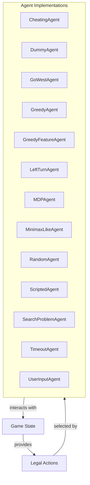

# Agent Strategies

## Overview
The `pacai.agents` module provides a diverse set of agent implementations and decision-making strategies tailored for game environments. These agents are designed to interact with the game state, making decisions based on various strategies ranging from random action selection to sophisticated algorithms like minimax and greedy approaches. Developers can utilize this module to create, test, and refine AI behaviors in games, allowing for both simple and complex interactions based on the game's mechanics.

This module is particularly useful for game developers looking to implement AI that can adapt to different scenarios, whether for testing purposes, creating competitive gameplay, or enhancing user experience through responsive agents. By leveraging the various agent classes, developers can easily integrate AI functionality into their game systems.

## Architecture & Design
The `pacai.agents` module employs several design patterns, including the Strategy pattern for defining various agent behaviors and the Template Method pattern in the `MDPAgent` class to enforce a structure for subclasses. The architecture is designed to facilitate easy extension and modification of agent behaviors while maintaining a clear separation of concerns.

### Key Abstractions
- **Agent Base Classes**: Many agents derive from abstract base classes that define essential methods, ensuring a consistent interface for interaction with the game environment.
- **Decision-Making Methods**: Each agent implements its own logic for decision-making, encapsulated within methods like `get_action`.

### Data Flow
Agents interact with the game state to retrieve information and determine actions. The flow typically involves:
1. Retrieving the current game state.
2. Evaluating possible actions based on the agent's strategy.
3. Returning the chosen action to the game engine.



## Key Components

### Main Classes and Responsibilities
- **CheatingAgent**: Manipulates the game state to achieve an immediate win by removing food markers and setting the score.
- **DummyAgent**: A placeholder agent that always returns a `STOP` action, serving as a baseline for more complex agents.
- **GoWestAgent**: Focuses on moving west, evaluating the legality of the action based on the current game state.
- **GreedyAgent**: Selects the best-scoring action based on potential outcomes, incorporating randomness for variability.
- **GreedyFeatureAgent**: Evaluates game states using features and weights to determine optimal actions.
- **LeftTurnAgent**: Determines the next action based on the last action taken and the current game state.
- **MDPAgent**: Provides a framework for agents operating within a Markov Decision Process, requiring subclasses to implement specific methods.
- **MinimaxLikeAgent**: Implements a minimax search algorithm for decision-making, featuring alpha-beta pruning.
- **RandomAgent**: Selects actions randomly from legal options, demonstrating a basic decision-making process.
- **ScriptedAgent**: Executes a predefined sequence of actions, allowing for scripted behaviors.
- **SearchProblemAgent**: Manages search operations within a defined search problem context.
- **TimeoutAgent**: Introduces configurable delays for managing timing behavior in the game.
- **UserInputAgent**: Interprets user inputs to determine appropriate actions based on the game state.

### Important Functions
- **get_action**: Most agents implement this method to determine the next action based on the current game state.
- **evaluate_state**: Used by agents like `GreedyFeatureAgent` to calculate scores based on features of the game state.
- **game_start** and **game_complete**: Used by agents like `TimeoutAgent` to manage game timing.

### Component Interactions
Agents interact with the `GameState` to retrieve information about legal actions and the current state. They then apply their decision-making logic to select an action, which is returned to the game engine for execution. The `MDPAgent` and `MinimaxLikeAgent` utilize more complex strategies that involve evaluating multiple states and actions to determine optimal decisions.

## Usage Examples
### Common Use Cases
- **AI Testing**: Use `DummyAgent` or `RandomAgent` for initial testing of game mechanics.
- **Competitive AI**: Implement `MinimaxLikeAgent` or `GreedyAgent` for challenging AI opponents.
- **User Interaction**: Utilize `UserInputAgent` to create agents that respond to player inputs.

### How to Use Main Classes
To create an agent, instantiate the desired class and call the `get_action` method with the current game state:

```python
from pacai.agents.greedy import GreedyAgent

agent = GreedyAgent()
action = agent.get_action(current_game_state)
```

### Integration Points
The agents can be integrated into any game loop that provides the current game state and expects an action in return. They can work alongside other modules in the `pacai` framework to enhance gameplay and AI behavior.

## Important Details
### Configuration or Setup Requirements
Ensure that the game environment provides a consistent `GameState` object that agents can interact with. Each agent may have specific initialization parameters that need to be configured based on the desired behavior.

### Caveats and Important Notes
- Agents like `CheatingAgent` are primarily for testing and should not be used in production gameplay.
- The performance of agents may vary based on the complexity of the game state and the implemented strategies.
- When using agents that involve randomness, results may differ between runs, which can affect testing and gameplay consistency.

This module provides a flexible and extensible framework for implementing a wide range of agent behaviors in game environments, allowing developers to create engaging and dynamic AI interactions.