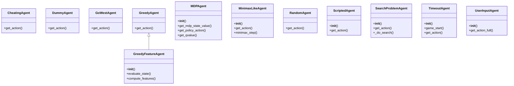

# Agent API Reference

This page provides a comprehensive reference for the classes and methods available within the agent implementations of the `pacai.agents` module. These APIs are designed for creating and managing various types of agents that interact with game environments, facilitating decision-making processes based on different strategies and behaviors.

## Classes

### CheatingAgent
**Purpose:** The `CheatingAgent` class manipulates the game state to achieve an immediate win by removing all food markers and setting the score to 1000.

**Key Methods:**
- `get_action`: Updates the game state to reflect a win condition and returns a stop action.

### DummyAgent
**Purpose:** The `DummyAgent` class serves as a simplistic placeholder agent that consistently returns a `STOP` action, allowing for testing and development of more complex agents.

**Key Methods:**
- `get_action`: Returns a `STOP` action, indicating no movement or change in position.

### GoWestAgent
**Purpose:** The `GoWestAgent` class determines the next action for a game character, focusing on moving west within the game environment.

**Key Methods:**
- `get_action`: Returns an action to move west if legal; otherwise, it returns a stop action.

### GreedyAgent
**Purpose:** The `GreedyAgent` class selects the best action based on potential outcomes, implementing a greedy strategy with a degree of randomness.

**Key Methods:**
- `get_action`: Evaluates legal actions and returns one based on their potential outcomes, chosen randomly from the best-scoring options.

### GreedyFeatureAgent
**Purpose:** The `GreedyFeatureAgent` class evaluates game states using features associated with actions to make informed decisions.

**Key Methods:**
- `__init__`: Initializes the agent with a feature extractor and weights.
- `evaluate_state`: Calculates a score for a given game state based on features.
- `compute_features`: Computes features for a specific state-action pair.

### MDPAgent
**Purpose:** The `MDPAgent` class provides a framework for agents operating within a Markov Decision Process (MDP) environment, focusing on learning optimal policies.

**Key Methods:**
- `__init__`: Initializes the agent with learning parameters and MDP state class.
- `get_mdp_state_value`: Retrieves the value associated with a specified MDP state.
- `get_policy_action`: Determines the optimal action for a given MDP state.
- `get_qvalue`: Retrieves the Q-value for a specific state-action pair.

### MinimaxLikeAgent
**Purpose:** The `MinimaxLikeAgent` class implements a minimax search algorithm for decision-making in games, including alpha-beta pruning.

**Key Methods:**
- `__init__`: Initializes the agent with parameters for the minimax search algorithm.
- `get_action`: Evaluates the current game state to determine the best action using minimax.
- `minimax_step`: Implements a single layer of the minimax algorithm.

### RandomAgent
**Purpose:** The `RandomAgent` class interacts with the game environment by selecting actions randomly based on the current game state.

**Key Methods:**
- `get_action`: Selects and returns a random legal action from the current game state.

### ScriptedAgent
**Purpose:** The `ScriptedAgent` class manages and executes a sequence of predefined actions.

**Key Methods:**
- `__init__`: Initializes the agent with a list of actions in various formats.
- `get_action`: Retrieves the next action from the predefined list or returns a 'STOP' action.

### SearchProblemAgent
**Purpose:** The `SearchProblemAgent` class manages search operations within a specified search problem context.

**Key Methods:**
- `__init__`: Configures the agent with a specific search problem class and solver.
- `get_action`: Retrieves the next action based on search results.
- `_do_search`: Performs a search operation on a given game state.

### TimeoutAgent
**Purpose:** The `TimeoutAgent` class manages timing behavior in a game environment, introducing configurable delays for actions.

**Key Methods:**
- `__init__`: Initializes the agent with configurable wait times.
- `game_start`: Initiates the game after a specified delay.
- `get_action`: Retrieves an action after a specified wait time.

### UserInputAgent
**Purpose:** The `UserInputAgent` class manages user interactions by interpreting user inputs to determine appropriate actions.

**Key Methods:**
- `__init__`: Initializes the agent, optionally remembering the last valid user action.
- `get_action_full`: Evaluates context and user inputs to return an appropriate action.

## Usage Notes

Common patterns for using these APIs include creating instances of specific agent classes based on the desired behavior (e.g., `GreedyAgent` for optimal decision-making or `RandomAgent` for testing). Agents can be combined or extended to create more complex behaviors, such as using `MDPAgent` as a base for specialized agents that require policy learning. The `ScriptedAgent` can be useful for testing predefined sequences of actions, while the `TimeoutAgent` can help manage game timing for smoother interactions. Each class is designed to encapsulate specific decision-making strategies, allowing developers to select or customize agents according to their game requirements.