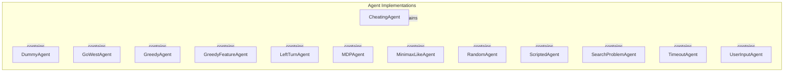

# Overview of Agent Strategies

## Introduction

This project is focused on developing intelligent agents for game environments, providing a framework for various decision-making strategies. It aims to enhance gameplay experiences by implementing agents that can interact with the game world in diverse ways, from simple random actions to complex strategic behaviors. The project addresses the need for flexible and adaptable AI agents that can be used for testing, demonstration, and gameplay enhancement.

The target audience includes game developers, AI researchers, and hobbyists interested in game AI. By offering a range of agent implementations, the project allows users to experiment with different strategies and understand the underlying mechanics of AI decision-making in games.

## Architecture Overview

The architecture of this project consists of several key components that work together to create a robust agent framework. The main components include various agent classes, each implementing distinct strategies for decision-making. These agents are organized within the `pacai/agents/` module, which serves as the core of the project. The architecture emphasizes modularity, allowing developers to easily extend or modify agent behaviors without impacting the overall system.

Key design patterns employed in this project include the use of abstract base classes for defining common interfaces, enabling different agent implementations to adhere to a consistent structure. Additionally, the project incorporates strategies such as greedy algorithms, minimax search, and user input handling, facilitating a wide range of agent behaviors.

## Key Modules

### pacai/agents/

This is the main module containing all the agent implementations. Each agent class within this module is designed to exhibit specific behaviors and decision-making strategies tailored to different gameplay scenarios. 

- **CheatingAgent**: Manipulates the game state to achieve an immediate win.
- **DummyAgent**: A placeholder agent that always returns a `STOP` action.
- **GoWestAgent**: Focuses on moving west if permissible; otherwise, it stops.
- **GreedyAgent**: Chooses the best-scoring actions based on potential outcomes, incorporating randomness.
- **GreedyFeatureAgent**: Evaluates game states using features and associated scores for decision-making.
- **LeftTurnAgent**: Determines the next action based on the last action taken and the current game state.
- **MDPAgent**: Operates within a Markov Decision Process environment, learning optimal policies.
- **MinimaxLikeAgent**: Implements a minimax search algorithm for decision-making, including alpha-beta pruning.
- **RandomAgent**: Selects actions randomly from the available legal actions.
- **ScriptedAgent**: Executes a predefined sequence of actions.
- **SearchProblemAgent**: Manages search operations within game environments using a defined cost function.
- **TimeoutAgent**: Controls timing behavior in the game, introducing delays for actions.
- **UserInputAgent**: Interprets user inputs to determine appropriate actions in the game.

These modules relate to each other through their shared purpose of enhancing gameplay through intelligent decision-making, allowing for a variety of strategies to be employed based on the agent's design.

## Getting Started

New contributors should begin by familiarizing themselves with the `pacai/agents/` module, as it contains the core functionality of the project. Understanding the `CheatingAgent`, `DummyAgent`, and `GreedyAgent` classes is particularly important, as they represent a range of simple to more complex decision-making strategies. 

Additionally, reviewing the `MDPAgent` and `MinimaxLikeAgent` classes will provide insights into more advanced strategies involving state evaluation and optimal action selection. Contributors are encouraged to explore the existing agent implementations to understand their behaviors and consider how they might extend or modify these agents to introduce new strategies or improve existing ones.