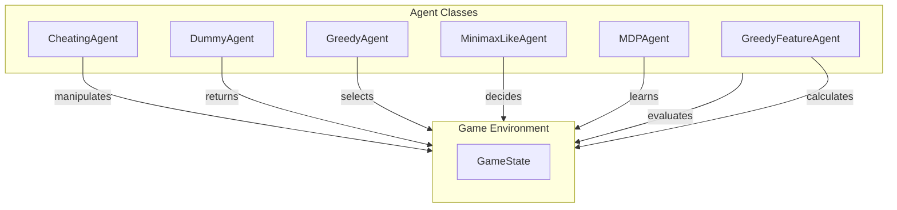

# Complex Agent Strategies

## Overview

The **Complex Agent Strategies** module is designed to facilitate the development and implementation of sophisticated agents in game environments. It encompasses various strategies, including greedy algorithms and minimax search techniques, allowing agents to make informed decisions based on the current game state. Developers can leverage this module to create agents that exhibit advanced behaviors, enhancing the overall gameplay experience and AI complexity.

This module is particularly useful for developers looking to implement competitive or strategic AI in games. By utilizing the provided classes and methods, developers can create agents that not only react to game states but also plan their actions based on potential future outcomes, making them more challenging opponents or collaborators in gameplay scenarios.

## Architecture & Design

The module employs several design patterns, including the use of abstract base classes for agent behavior and strategy encapsulation. Key abstractions include the `MDPAgent` class, which provides a framework for agents operating within a Markov Decision Process environment, and the `MinimaxLikeAgent`, which implements the minimax algorithm for decision-making.

### Data Flow
The data flow within the module is structured around the interaction between agents and the game environment. Agents evaluate the game state, determine possible actions, and execute decisions based on their strategies.



## Key Components

### Main Classes and Responsibilities

1. **CheatingAgent**
   - **Responsibility:** Manipulates the game state to achieve an immediate win.
   - **Key Method:** `get_action` - Alters the game state directly to ensure a win.

2. **DummyAgent**
   - **Responsibility:** Acts as a placeholder agent that does not engage in movement.
   - **Key Method:** `get_action` - Consistently returns a `STOP` action.

3. **GreedyAgent**
   - **Responsibility:** Selects optimal actions based on potential outcomes.
   - **Key Method:** `get_action` - Chooses the best-scoring action from legal options.

4. **GreedyFeatureAgent**
   - **Responsibility:** Evaluates game states using feature-based scoring.
   - **Key Methods:** 
     - `evaluate_state` - Computes a score for a game state based on features.
     - `compute_features` - Generates features for a state-action pair.

5. **MinimaxLikeAgent**
   - **Responsibility:** Implements minimax search for decision-making.
   - **Key Methods:**
     - `get_action` - Evaluates the game state to determine the best action.
     - `minimax_step` - Executes a layer of the minimax algorithm.

6. **MDPAgent**
   - **Responsibility:** Operates within a Markov Decision Process environment.
   - **Key Methods:**
     - `get_policy_action` - Determines the optimal action based on the current policy.
     - `get_mdp_state_value` - Retrieves the value of a specified MDP state.

### Interaction Between Components

The classes interact with the `GameState` object, which represents the current state of the game. Agents evaluate this state to determine their actions. For example, the `GreedyAgent` and `GreedyFeatureAgent` assess the game state to select optimal actions, while the `MinimaxLikeAgent` uses a more complex evaluation strategy to decide on moves based on potential future states.

## Usage Examples

### Common Use Cases

1. **Creating a Competitive AI Opponent**
   - Use the `MinimaxLikeAgent` to implement a challenging opponent that can evaluate multiple future game states and make strategic decisions.

2. **Testing and Demonstration**
   - The `CheatingAgent` can be used in testing scenarios where immediate victory is required without engaging in normal gameplay mechanics.

3. **Baseline Agent Development**
   - The `DummyAgent` serves as a baseline for developers to build more complex behaviors upon.

### Integration Points

Developers can integrate these agents into their game logic by instantiating the desired agent class and invoking the `get_action` method based on the current `GameState`. For example:

```python
from pacai.agents.greedy import GreedyAgent
from pacai.core import GameState

game_state = GameState()
agent = GreedyAgent()
action = agent.get_action(game_state)
```

## Important Details

### Configuration Requirements

- Ensure that the game environment is properly set up to provide the necessary `GameState` objects to the agents.
- Agents may require specific parameters during initialization, such as exploration rates for the `MDPAgent`.

### Caveats and Important Notes

- Agents like `CheatingAgent` should be used cautiously, as they bypass normal gameplay mechanics and are primarily for testing purposes.
- The `GreedyFeatureAgent` requires a feature extractor function to compute scores, which must be defined and passed during initialization.
- The performance of agents may vary based on the complexity of the game state and the strategies implemented.

By understanding the architecture and capabilities of the **Complex Agent Strategies** module, developers can effectively create and manage sophisticated agents that enhance the interactivity and challenge of their game environments.