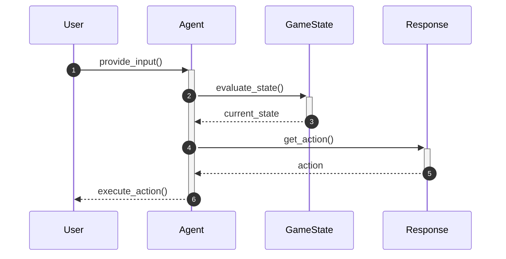

# Integrating Agents into Game Systems

This guide will teach you best practices for integrating various agents into larger game systems to enhance gameplay experiences. It is intended for developers familiar with Python who are looking to implement or improve agent behaviors in their game projects.

## Concepts

When integrating agents into game systems, understanding the roles and functionalities of different agent classes is crucial. The following classes from the `pacai.agents` module are central to this integration:

- **CheatingAgent**: Manipulates the game state for immediate wins.
- **DummyAgent**: Acts as a placeholder, always returning a `STOP` action.
- **GoWestAgent**: Moves the character west if allowed.
- **GreedyAgent** and **GreedyFeatureAgent**: Make optimal decisions based on scoring and features.
- **MDPAgent**: Operates within a Markov Decision Process framework for learning optimal policies.
- **MinimaxLikeAgent**: Implements a minimax search algorithm for decision-making.
- **RandomAgent**: Chooses actions randomly from available options.
- **ScriptedAgent**: Executes a predefined sequence of actions.
- **UserInputAgent**: Interprets user inputs to determine actions.
- **TimeoutAgent**: Manages timing behavior in game interactions.

These classes can be combined to create complex behaviors and enhance the overall gameplay experience.



## Step-by-Step Guide

### 1. Choose the Right Agent Class

Select an agent class based on the desired behavior in your game. For example:
- Use `GreedyAgent` for optimal decision-making.
- Use `RandomAgent` for unpredictable behavior.

### 2. Initialize the Agent

Create an instance of your chosen agent class. For example, to create a `GreedyAgent`:

```python
from pacai.agents.greedy import GreedyAgent

agent = GreedyAgent()
```

### 3. Integrate with Game State

Ensure your agent can access the current game state. This typically involves passing a `GameState` object to the agent's `get_action` method.

```python
from pacai.core import GameState

current_state = GameState()
action = agent.get_action(current_state)
```

### 4. Implement Action Execution

Once the agent determines an action, integrate it into the game loop to execute the action. For example:

```python
if action is not None:
    game.execute_action(action)
```

### 5. Test and Iterate

Test the agent's behavior in various scenarios. Adjust parameters or switch agent classes as needed to refine gameplay. For instance, if the `GreedyAgent` is too predictable, consider using `RandomAgent` for variability.

## Examples

### Using the CheatingAgent

To demonstrate how to use the `CheatingAgent`, you can create an instance and call the `get_action` method to simulate a win:

```python
from pacai.agents.cheating import CheatingAgent

cheating_agent = CheatingAgent()
action = cheating_agent.get_action(current_state)
```

This will manipulate the game state to achieve an immediate win.

### Implementing User Input

For a more interactive experience, use the `UserInputAgent` to handle user commands:

```python
from pacai.agents.userinput import UserInputAgent

user_agent = UserInputAgent()
user_action = user_agent.get_action_full(current_state)
```

This allows the agent to respond to user inputs effectively.

## Common Pitfalls

- **Not Handling Game State Properly**: Ensure that the current game state is passed correctly to the agent. Failing to do so can lead to unexpected behavior.
- **Overcomplicating Agent Logic**: Start with simpler agents like `DummyAgent` or `RandomAgent` to establish a baseline before implementing more complex strategies.
- **Ignoring Timing Issues**: When using agents like `TimeoutAgent`, ensure that timing delays do not disrupt the game flow or user experience.

By following these guidelines and utilizing the provided classes effectively, you can enhance your game systems with intelligent agent behaviors that improve gameplay experiences.