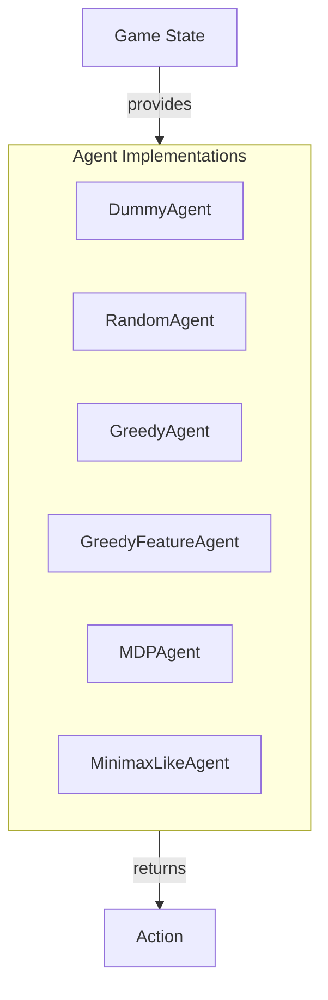

# Simple Agent Implementations

## Overview

The `pacai.agents` module provides a collection of simplistic agent implementations designed for use within game environments. This module includes agents like `DummyAgent` and `RandomAgent`, which serve as foundational components for testing and developing more complex agent behaviors. Developers can utilize these agents to establish baseline interactions, conduct experiments, or create prototypes without the need for sophisticated decision-making algorithms.

These simplistic agents are particularly useful during the early stages of game development or when testing the overall game framework. By employing agents that exhibit basic behaviors, developers can ensure that the game mechanics function correctly before integrating more advanced AI strategies.

## Architecture & Design

The `pacai.agents` module employs a straightforward architecture that emphasizes simplicity and modularity. It utilizes a combination of abstract base classes and concrete implementations to facilitate the development of various agent behaviors. This design allows for easy extension and modification of agent functionalities.

### Key Design Patterns
- **Abstract Base Class**: The `MDPAgent` class serves as a base for agents operating in a Markov Decision Process environment, requiring subclasses to implement specific methods.
- **Strategy Pattern**: Agents like `GreedyAgent` and `RandomAgent` implement different strategies for action selection, allowing for flexible behavior based on the game context.

### Data Flow
The data flow within the module is primarily driven by the game state, which is passed to the agents during action retrieval. Each agent evaluates the current state and determines the appropriate action based on its internal logic.

## Key Components

### Main Classes

- **DummyAgent**
  - **Responsibility**: Returns a `STOP` action regardless of the game state.
  - **Key Method**: 
    - `get_action`: Returns a static `STOP` action.

- **RandomAgent**
  - **Responsibility**: Selects actions randomly from the available legal actions based on the game state.
  - **Key Method**: 
    - `get_action`: Returns a random legal action.

- **GreedyAgent**
  - **Responsibility**: Chooses the best-scoring action based on potential outcomes.
  - **Key Method**: 
    - `get_action`: Evaluates legal actions and randomly selects one from the best-scoring options.

- **GreedyFeatureAgent**
  - **Responsibility**: Evaluates game states using features to determine optimal actions.
  - **Key Methods**: 
    - `evaluate_state`: Computes a score for a game state based on features.
    - `compute_features`: Extracts features for a specific state-action pair.

- **MDPAgent**
  - **Responsibility**: Provides a framework for agents operating in MDP environments.
  - **Key Methods**: 
    - `get_policy_action`: Determines the optimal action based on the current policy.
    - `get_mdp_state_value`: Retrieves the value of a specified MDP state.

- **MinimaxLikeAgent**
  - **Responsibility**: Implements a minimax search algorithm for decision-making.
  - **Key Method**: 
    - `get_action`: Evaluates the game state to determine the best action using minimax logic.

### Component Interactions
The agents interact with the game state by receiving it as input and returning an action based on their internal logic. For example, `RandomAgent` and `GreedyAgent` both evaluate the game state but employ different strategies for action selection.

## Usage Examples

### Common Use Cases
1. **Testing Game Mechanics**: Use `DummyAgent` to ensure that the game framework operates correctly without complex decision-making.
2. **Randomized Behavior**: Implement `RandomAgent` to introduce variability in agent actions during gameplay.
3. **Greedy Strategies**: Utilize `GreedyAgent` to test how well the game adapts to agents making optimal decisions based on scoring.

### Integration Points
These agents can be easily integrated into any game loop where agent actions are required. For instance, in a turn-based game, the game state can be passed to the agent's `get_action` method, and the returned action can be executed within the game.

## Important Details

### Configuration Requirements
- Ensure that the game environment is properly set up to provide the necessary `GameState` objects to the agents.
- Agents may require specific parameters during initialization, particularly those that involve feature extraction or scoring.

### Caveats
- The `DummyAgent` and `RandomAgent` do not provide strategic gameplay and should not be used in scenarios where intelligent decision-making is required.
- Agents like `GreedyAgent` and `GreedyFeatureAgent` may lead to predictable behaviors if not combined with randomness or other strategies.

By understanding the functionalities and interactions of these simplistic agents, developers can effectively utilize them within their game projects, paving the way for more complex AI implementations in the future.