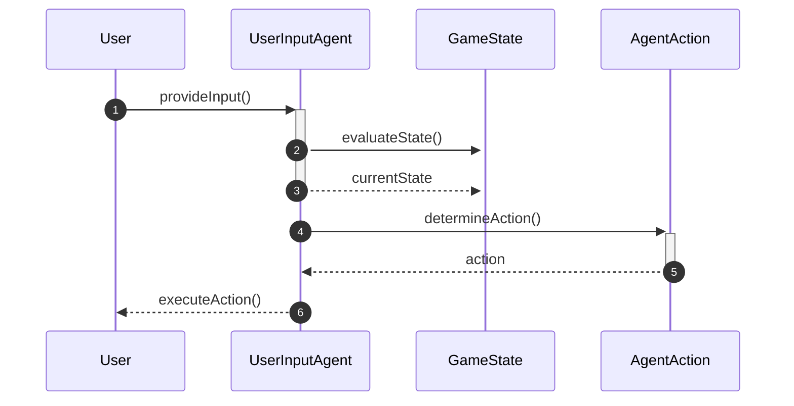

# User Input Handling in Agents

This guide provides practical instructions on implementing user input handling within agent strategies for dynamic decision-making in a game environment. It is aimed at developers looking to enhance their agents' interactivity by effectively interpreting user inputs and adapting actions accordingly.

## Concepts

In this section, we will explore the key components involved in user input handling, focusing on the `UserInputAgent` class. This class is responsible for managing user interactions and determining appropriate actions based on user inputs and the current game state.

### Workflow Overview

The typical workflow for user input handling involves the following steps:
1. The agent receives user input.
2. The agent evaluates the current game state.
3. The agent determines the appropriate action based on both the user input and game state.
4. The agent executes the action.



## Step-by-Step Guide

### Step 1: Initialize the UserInputAgent

Begin by creating an instance of the `UserInputAgent`. You can choose to remember the last valid action by setting the `remember_last_action` parameter to `True`.

```python
from pacai.agents.userinput import UserInputAgent

agent = UserInputAgent(remember_last_action=True)
```

### Step 2: Handle User Input

Capture the user input within your game loop. This input will be passed to the agent for processing.

```python
user_input = get_user_input()  # Function to capture user input
```

### Step 3: Evaluate the Game State

Use the `get_action_full` method of the `UserInputAgent` to evaluate the current game state and user input. This method will return an `AgentAction` object based on the provided context.

```python
current_game_state = get_current_game_state()  # Function to get the current game state
action = agent.get_action_full(current_game_state, user_input)
```

### Step 4: Execute the Action

Once the action is determined, execute it within your game environment. The action can be an immediate response to the user input or a fallback action if the input is invalid.

```python
execute_action(action)  # Function to execute the determined action
```

## Examples

### Example of User Input Handling

Here’s a simple example demonstrating how to implement user input handling using the `UserInputAgent`:

```python
from pacai.agents.userinput import UserInputAgent

# Initialize the agent
agent = UserInputAgent(remember_last_action=True)

# Game loop
while game_is_running:
    user_input = get_user_input()  # Capture user input
    current_game_state = get_current_game_state()  # Get the current game state
    action = agent.get_action_full(current_game_state, user_input)  # Determine action
    execute_action(action)  # Execute the action
```

### Example of Fallback Action

In cases where the user input is invalid, the `get_action_full` method will return a fallback action. Ensure your game logic can handle this appropriately:

```python
if action.is_fallback():
    print("Invalid input, executing fallback action.")
```

## Common Pitfalls

- **Invalid User Input**: Ensure that the user input is validated before passing it to the agent. Invalid inputs can lead to unexpected behavior.
- **Game State Awareness**: The agent's decision-making relies heavily on the current game state. Ensure that the game state is accurately updated before invoking the `get_action_full` method.
- **Memory Management**: If `remember_last_action` is set to `True`, ensure that your game logic correctly manages the last valid action to avoid confusion in subsequent inputs.

By following this guide, you can effectively implement user input handling in your agents, leading to a more interactive and engaging gameplay experience.