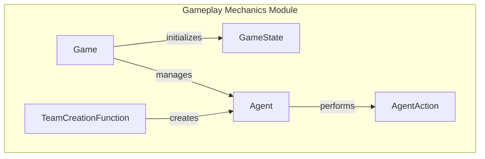

# Gameplay Mechanics

## Overview
The Gameplay Mechanics module is responsible for the setup, state management, and user interaction within various game implementations, including Capture and Pac-Man. This module provides the foundational structure for initializing game states, managing agent behaviors, and facilitating interactions between players and the game environment. Developers would use this module when creating or modifying games that require complex state management and agent interactions, ensuring a cohesive and engaging gameplay experience.

## Architecture & Design
The module employs several design patterns, including the factory pattern for creating game states and the observer pattern for managing agent actions and game events. Key abstractions include the `Game`, `GameState`, and `Agent` classes, which encapsulate the core functionalities of game initialization, state management, and agent behavior. The data flow primarily revolves around the interaction between these classes, where game states are updated based on agent actions and user inputs.



## Key Components

### Main Classes
- **Game**: Responsible for managing the lifecycle of a game, including initialization, state processing, and determining game completion. It provides methods for processing turns and managing game results.
- **GameState**: Manages the state of the game, including agent configurations, actions, and overall game status. It facilitates game initialization and turn handling.
- **Agent**: Represents an agent within the game, managing its actions and state evaluations throughout the game lifecycle. It adapts behavior based on game states and user inputs.
- **AgentAction**: Manages the state and actions of an agent, encapsulating details such as the action taken and performance metrics.
- **TeamCreationFunction**: Assembles a capture team of agents, ensuring that the final team contains exactly two agents while accommodating a maximum of ten.

### Important Functions
- **get_initial_state**: Initializes and returns a `GameState` object using the provided game board and agent information.
- **process_turn**: Processes an agent's action within a game state, updating the game state accordingly.
- **create_team_baseline**: Creates a balanced team of agents, alternating between offensive and defensive roles.
- **generate**: Generates a random capture board for a game, customizing the board's characteristics based on parameters.

### Component Interactions
The `Game` class initializes the `GameState`, which in turn manages the `Agent` instances. Agents perform actions that are encapsulated within `AgentAction` objects, allowing for detailed tracking of agent behavior. The `TeamCreationFunction` interacts with the `Agent` class to ensure proper team assembly, facilitating dynamic gameplay.

## Usage Examples
### Common Use Cases
- **Game Initialization**: Developers can create a new game instance by utilizing the `Game` class, which sets up the initial game state and agent configurations.
- **Agent Interaction**: By implementing the `Agent` class, developers can define custom behaviors for agents, allowing them to react to game states and user inputs effectively.

### How to Use the Main Classes
1. **Creating a Game**:
   ```python
   from pacai.capture.game import Game
   game = Game()
   initial_state = game.get_initial_state()
   ```

2. **Processing Turns**:
   ```python
   while not game.check_end(initial_state):
       action = agent.get_action(initial_state)
       initial_state = game.process_turn(action)
   ```

3. **Creating Teams**:
   ```python
   from pacai.capture.team import TeamCreationFunction
   team_creator = TeamCreationFunction()
   team = team_creator(agent_infos)
   ```

## Important Details
### Configuration or Setup Requirements
- Ensure that all necessary game assets, such as sprites and board configurations, are properly loaded before initializing the game.
- Agents must be defined with appropriate behaviors and configurations to interact effectively within the game environment.

### Caveats and Important Notes
- Be mindful of the maximum number of agents allowed per team when using the `TeamCreationFunction` to avoid runtime errors.
- The game state must be consistently updated after each turn to reflect the current status of the game accurately.

This module provides a robust framework for managing gameplay mechanics, ensuring that developers can create engaging and dynamic gaming experiences. By understanding the key components and their interactions, developers can effectively leverage this module to enhance their game implementations.