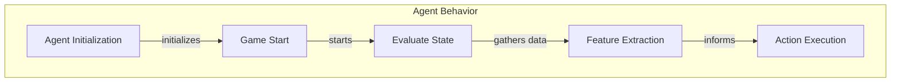

# Agent Behavior and Strategies

## What Is It?
Agent behavior and strategies refer to the decision-making processes and actions taken by agents within a game environment. In the context of the provided codebase, agents are designed to perform specific roles, such as offensive or defensive actions, based on their evaluations of the game state. This concept is crucial as it directly influences gameplay dynamics, player interactions, and overall game outcomes. By implementing various strategies, agents can adapt to different scenarios, enhancing the complexity and enjoyment of the game.

Understanding agent behavior and strategies is essential for developers working on the codebase. It allows them to refine agent functionalities, introduce new strategies, and ensure that agents respond effectively to the evolving game state. The implementation of these strategies is encapsulated within various classes and functions, each contributing to the agents' ability to make informed decisions during gameplay.

## How It Works
The agent behavior and strategies are primarily implemented through the `DefensiveAgent` and `OffensiveAgent` classes found in the `pacai/capture/agents.py` file. These classes define how agents perceive their environment, evaluate their options, and execute actions based on their strategic roles.

1. **Agent Initialization**: Each agent is initialized with specific parameters, including feature weights and distance calculations. For instance, the `DefensiveAgent` class allows customization of base weights for various features, while the `OffensiveAgent` class focuses on calculating distances to optimize its actions.

2. **Game Start**: When a game begins, the `game_start` method is invoked for each agent. This method computes relevant distances based on the initial game state, ensuring that agents have the necessary information to make strategic decisions.

3. **Action Evaluation**: During gameplay, agents continuously evaluate the current game state using methods like `evaluate_state`. This evaluation assesses the quality of potential actions based on predefined criteria, allowing agents to choose the most advantageous moves.

4. **Feature Extraction**: The agents utilize feature extraction functions, such as `_extract_baseline_defensive_features` and `_extract_baseline_offensive_features`, to gather relevant data from the game state. These features inform the agents' decision-making processes, enabling them to adapt their strategies dynamically.

5. **Action Execution**: Once an agent determines the best action, it executes this action through methods like `get_action_full`, which returns an `AgentAction` object representing the chosen move. This action is then processed within the game loop, affecting the overall game state.

The flow of agent behavior and strategies can be visualized in the following diagram:

## Key Classes/Functions
Several key classes and functions implement the concept of agent behavior and strategies:

- **DefensiveAgent**: This class focuses on defensive strategies, allowing agents to calculate distances and evaluate threats. It initializes with customizable feature weights and prepares agents for gameplay through the `game_start` method.

- **OffensiveAgent**: Similar to the `DefensiveAgent`, this class emphasizes offensive strategies. It computes distances to food and ghosts, enabling agents to make aggressive moves. The `game_start` method prepares the agent by processing the initial game state.

- **GameState**: The `GameState` class manages the overall game environment, including agent positions and actions. It plays a critical role in facilitating interactions between agents and the game board.

- **Feature Extraction Functions**: Functions like `_extract_baseline_defensive_features` and `_extract_baseline_offensive_features` are responsible for gathering relevant features from the game state, which inform agents' decision-making processes.

- **AgentAction**: This class encapsulates the actions taken by agents, allowing for structured representation and easy manipulation of agent behaviors.

## Examples
In practice, the agent behavior and strategies can be observed during a game session. For example, when playing a capture game, the `DefensiveAgent` may prioritize actions that protect its territory by evaluating the positions of opposing agents and adjusting its movements accordingly. Conversely, the `OffensiveAgent` will focus on actions that maximize its score by seeking out food items while avoiding ghosts.

A common usage pattern involves initializing a game with a mix of `DefensiveAgent` and `OffensiveAgent` instances, allowing for a dynamic interplay of strategies. As the game progresses, agents will continuously evaluate the game state, extract features, and execute actions based on their roles, leading to a rich and engaging gameplay experience.

By understanding and leveraging these concepts, developers can enhance the complexity of agent interactions, introduce new strategies, and ultimately create a more immersive gaming environment.