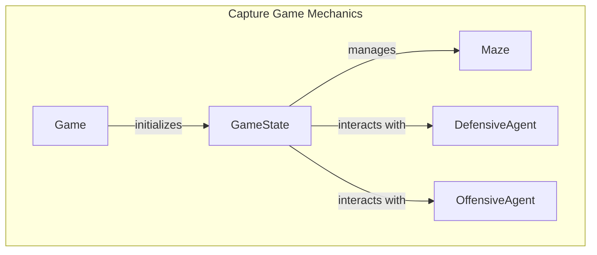

# Capture Game Mechanics

## Overview

The Capture module is responsible for implementing the mechanics of a Capture game, which involves strategic interactions between agents within a maze-like environment. This module provides the necessary classes and functions to manage game state, agent behaviors, and team configurations, allowing developers to create engaging gameplay experiences. It is particularly useful for developers looking to build simulations or games that require intelligent agent interactions and dynamic environments.

Developers would use this module when creating games that involve capturing objectives, managing team dynamics, and simulating agent behaviors. The encapsulated logic facilitates the development of both offensive and defensive strategies, making it suitable for educational purposes, game development, or AI research.

## Architecture & Design

The Capture module employs several design patterns, including factory patterns for initializing game states and configuration patterns for agent setup. Key abstractions include the `Game`, `GameState`, `Maze`, and agent classes (`DefensiveAgent` and `OffensiveAgent`), which interact to create a cohesive game environment.

### Data Flow
1. The `Game` class initializes the game state using the `get_initial_state` method, which creates a `GameState` object.
2. The `GameState` manages the positions and statuses of agents, processing their actions and interactions.
3. Agents (`DefensiveAgent` and `OffensiveAgent`) utilize the game state to make decisions based on their respective strategies.



## Key Components

### Main Classes

- **Game**
  - **Responsibilities**: Initializes the game state and manages the overall game flow.
  - **Key Method**: `get_initial_state`: Creates and returns a `GameState` object.

- **GameState**
  - **Responsibilities**: Manages the state of the game, including agent positions, scores, and interactions.
  - **Key Methods**:
    - `get_legal_actions`: Retrieves legal actions for an agent based on its current position.
    - `process_agent_crash`: Handles agent crashes and updates scores accordingly.

- **Maze**
  - **Responsibilities**: Constructs and manages the maze layout for the game.
  - **Key Method**: `build`: Creates the maze structure and populates it with game elements.

- **DefensiveAgent**
  - **Responsibilities**: Represents an agent focused on defensive strategies.
  - **Key Methods**:
    - `__init__`: Initializes the agent with customizable weights.
    - `game_start`: Prepares the agent for gameplay by computing distances.

- **OffensiveAgent**
  - **Responsibilities**: Represents an agent focused on offensive strategies.
  - **Key Methods**:
    - `__init__`: Initializes the agent with customizable weights.
    - `game_start`: Prepares the agent for gameplay by computing distances.

### Important Functions

- **create_team_baseline**: Generates a balanced team of agents, alternating between offensive and defensive roles.
- **generate**: Creates a random capture board based on specified parameters.
- **log_capture_results**: Logs the results of game simulations, calculating averages for scores and turns.

### Component Interactions

The `Game` class interacts with `GameState` to manage the game's lifecycle, while `GameState` coordinates with `Maze` to represent the game environment. Agents utilize the game state to make informed decisions based on their roles, with the `DefensiveAgent` and `OffensiveAgent` classes implementing specific strategies for gameplay.

## Usage Examples

### Common Use Cases

1. **Initializing a Game**: Use the `Game` class to set up the initial game state and start the gameplay loop.
2. **Agent Configuration**: Customize agents using the `DefensiveAgent` and `OffensiveAgent` classes to create strategic gameplay.
3. **Team Creation**: Utilize the `create_team_baseline` function to assemble teams with balanced capabilities.

### Example Code

```python
from pacai.capture.game import Game
from pacai.capture.team import create_team_baseline

# Initialize the game
game = Game()
initial_state = game.get_initial_state()

# Create a balanced team
team = create_team_baseline()
```

## Important Details

### Configuration or Setup Requirements

- Ensure that the necessary dependencies for the Capture module are installed and properly configured in your development environment.
- Customize agent weights and team configurations as needed to tailor gameplay experiences.

### Caveats and Important Notes

- The `GameState` class is central to managing agent interactions and game progress; understanding its methods is crucial for effective gameplay implementation.
- The maze generation process can be influenced by parameters such as seed and size, which may affect gameplay dynamics.
- Be mindful of the maximum number of agents allowed per team when using team creation functions to avoid unexpected behavior.

This documentation provides a comprehensive overview of the Capture game mechanics, detailing the architecture, key components, and usage examples to assist developers in leveraging the module effectively.