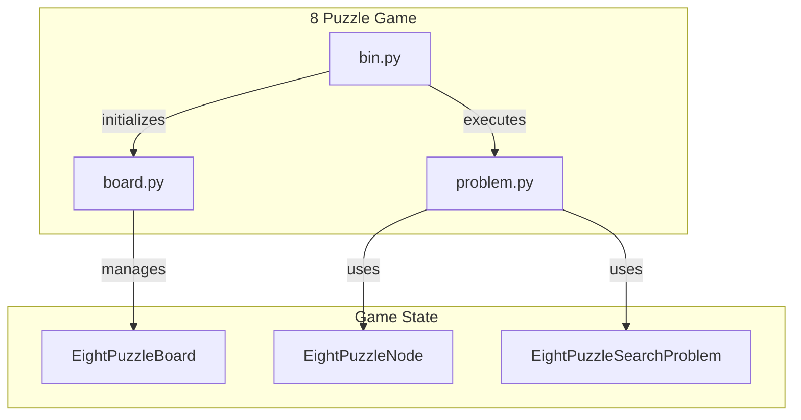

# 8 Puzzle Implementation

## Overview
The 8 Puzzle Implementation module provides the necessary components to configure and execute the classic 8 Puzzle game. This module is designed for developers who want to integrate the 8 Puzzle game into their applications or utilize its functionality for educational purposes, algorithm testing, or game development. By encapsulating the game logic, state management, and user interaction, this module allows for seamless integration and manipulation of the 8 Puzzle game mechanics.

Developers would use this module when they need to create, solve, or manipulate the 8 Puzzle game state, whether for building a user interface, testing algorithms, or implementing game-solving strategies. The modular design facilitates easy extension and modification of game behaviors.

## Architecture & Design
The architecture of the 8 Puzzle Implementation module follows a structured design pattern that separates concerns into distinct classes and functions. The key abstractions include the `EightPuzzleBoard`, `EightPuzzleNode`, and `EightPuzzleSearchProblem` classes, which collectively manage the game state, node representation, and search problem logic.

### Design Patterns Used
- **Encapsulation**: Each class encapsulates its state and behavior, promoting modularity.
- **Composition**: The `EightPuzzleNode` class composes an `EightPuzzleBoard`, allowing for clear relationships between game states and their representations.

### Data Flow
1. The user interacts with the command-line interface to start the game.
2. The `bin.py` file processes command-line arguments and initializes the game.
3. The `EightPuzzleBoard` class manages the state of the puzzle.
4. The `EightPuzzleNode` class represents configurations of the board.
5. The `EightPuzzleSearchProblem` class facilitates the exploration of possible moves and goal checking.



## Key Components

### Main Classes

#### EightPuzzleBoard
- **Location:** `pacai/eightpuzzle/board.py`
- **Responsibilities:** Represents the state of the 8 Puzzle game, allowing for tile manipulation, state validation, and action retrieval.
- **Key Methods:**
  - `__init__`: Initializes the board with a list of integers.
  - `is_solved`: Checks if the current configuration is the solved state.
  - `get_legal_actions`: Retrieves possible moves based on the blank tile's position.

#### EightPuzzleNode
- **Location:** `pacai/eightpuzzle/problem.py`
- **Responsibilities:** Represents a node in the state space of the 8 Puzzle, encapsulating an `EightPuzzleBoard`.
- **Key Methods:**
  - `__init__`: Initializes the node with an `EightPuzzleBoard`.
  - `__eq__`: Checks equality with another `EightPuzzleNode`.
  - `__lt__`: Compares nodes for ordering based on board configurations.

#### EightPuzzleSearchProblem
- **Location:** `pacai/eightpuzzle/problem.py`
- **Responsibilities:** Manages the state and operations of the 8 Puzzle game, facilitating the search for solutions.
- **Key Methods:**
  - `__init__`: Initializes the problem with a starting `EightPuzzleBoard`.
  - `get_starting_node`: Returns a new `EightPuzzleNode` representing the starting state.
  - `get_successor_nodes`: Retrieves possible successor nodes based on legal moves.

### Important Functions

- **`_get_parser`**: Configures the command-line argument parser for the game.
- **`_parse_args`**: Parses command-line arguments and initializes logging settings.
- **`from_rng`**: Generates a scrambled `EightPuzzleBoard` from a solved state.
- **`init_from_args`**: Initializes game components based on parsed command-line arguments.
- **`main`**: Starts the game by executing the main game logic.
- **`run`**: Executes a single game of the 8 Puzzle, providing interactive output.
- **`set_cli_args`**: Configures command-line arguments for user interaction.

### Component Interactions
The `bin.py` file serves as the entry point for the game, initializing the game state and managing user interactions through command-line arguments. It interacts with the `EightPuzzleBoard` to manage the game state and with the `EightPuzzleNode` and `EightPuzzleSearchProblem` to facilitate the exploration of possible moves and goal checking.

## Usage Examples

### Common Use Cases
- **Starting a Game**: Use the command-line interface to start a new game of the 8 Puzzle.
- **Solving the Puzzle**: Implement algorithms that utilize the `EightPuzzleSearchProblem` class to find solutions.
- **Custom Game States**: Create custom game states using the `EightPuzzleBoard` class and manipulate them programmatically.

### Example Code Snippet
```python
from pacai.eightpuzzle.board import EightPuzzleBoard
from pacai.eightpuzzle.problem import EightPuzzleSearchProblem

# Initialize a solved board
solved_board = EightPuzzleBoard([1, 2, 3, 4, 5, 6, 7, 8, 0])

# Check if the board is solved
print(solved_board.is_solved())  # Output: True

# Create a search problem
search_problem = EightPuzzleSearchProblem(solved_board)

# Get the starting node
starting_node = search_problem.get_starting_node()
```

## Important Details

### Configuration or Setup Requirements
- Ensure that the `argparse` module is available for command-line argument parsing.
- The module should be executed in an environment where the necessary dependencies are installed.

### Caveats and Important Notes
- The `EightPuzzleBoard` class requires a valid list of integers for initialization; invalid inputs will raise exceptions.
- The game logic assumes that the puzzle can be solved from the given initial state; unsolvable configurations may lead to unexpected behavior.
- When using the command-line interface, ensure that all required arguments are provided to avoid runtime errors.

This documentation provides a comprehensive overview of the 8 Puzzle Implementation module, detailing its architecture, key components, and usage. Developers can leverage this module to build engaging applications or conduct experiments with the 8 Puzzle game.