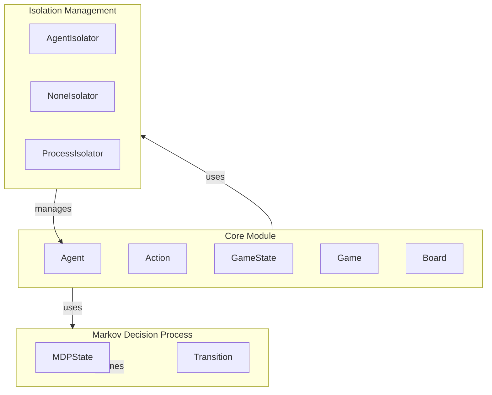

# Game Environment Overview

## Introduction

This project is a game environment framework designed to facilitate the development and management of interactive games, particularly those involving agents that perform actions based on game states. It addresses the complexities of agent lifecycle management, state evaluation, and game progression, providing a structured approach to building dynamic and engaging gameplay experiences. The framework is particularly useful for developers and researchers interested in artificial intelligence, game design, and simulation, enabling them to create sophisticated game mechanics and agent behaviors.

By offering a modular architecture, the project allows for easy integration of various components, such as game boards, agents, and action processing. This flexibility supports the development of diverse game scenarios, from simple board games to complex simulations, making it suitable for both educational purposes and advanced game development.

## Architecture Overview

The architecture of the game environment is organized into several key modules, each responsible for specific aspects of the game lifecycle. The primary components include the `core` module, which encompasses essential functionalities such as agent management, action processing, and game state evaluation. Other important modules include `isolation`, which manages agent interactions in a controlled environment, and `mdp`, which implements Markov Decision Processes for decision-making scenarios.

The design employs various patterns, including factory methods for agent instantiation and abstract base classes to enforce contracts for agent behavior and game mechanics. This modular approach enhances code reusability and maintainability, allowing developers to extend or modify individual components without affecting the overall system.

## Key Modules

### Core Module
- **Agent**: Represents the game agents, managing their actions and evaluations throughout the game lifecycle.
- **Action**: Processes input strings and manages action validation, ensuring only valid actions are executed.
- **GameState**: Manages the current state of the game, including agent actions and game status.
- **Game**: Orchestrates the main game loop, handling initialization, state processing, and game conclusion.
- **Board**: Defines the structure and functionality of the game board, including the placement of walls and agents.

### Isolation Management
- **AgentIsolator**: An abstract base class for managing agents within a game environment, requiring subclasses to implement key methods for agent lifecycle management.
- **NoneIsolator**: Manages a collection of agents, overseeing their initialization, game state management, and action retrieval.
- **ProcessIsolator**: Handles multiple agent processes, ensuring effective communication and interaction between agents within the game.

### Markov Decision Process (MDP)
- **MDPState**: Represents a state within the MDP framework, focusing on terminal state identification.
- **Transition**: Encapsulates the state, action, probability, and reward associated with transitions in the MDP.

## Getting Started

New contributors should begin by familiarizing themselves with the `core` module, as it contains the foundational classes and functionalities essential for understanding the game environment. Key classes to explore include `Agent`, `Game`, and `GameState`, which provide insights into agent behavior and game mechanics.

Additionally, reviewing the `Board` class will help in understanding how game layouts are structured and manipulated. Contributors can also look into the `Isolation` and `MDP` modules to grasp how agent interactions and decision-making processes are managed within the game environment.

For practical guidance, setting up a local development environment and running example games will provide hands-on experience with the framework, allowing contributors to see how different components interact in real-time.