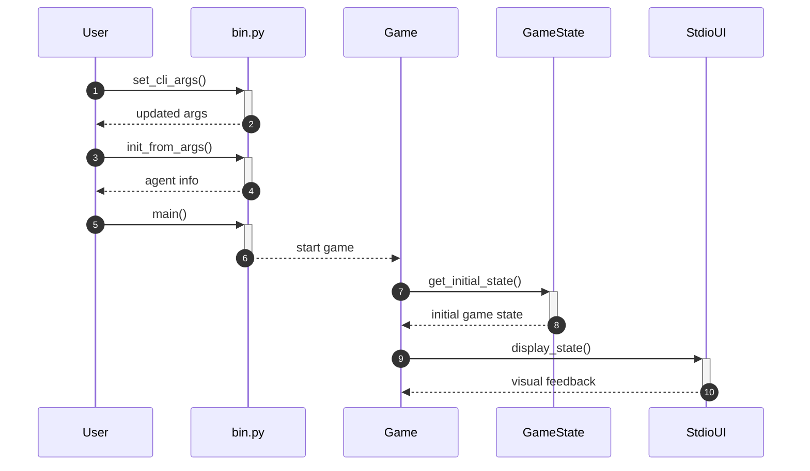

# Pac-Man Game Setup

This guide will teach you how to set up and customize the Pac-Man game, focusing on game states and user interactions. It is intended for developers who are familiar with Python and want to understand how to configure and extend the Pac-Man game system.

## Concepts

In this section, we will cover key concepts that are essential for understanding how to set up and customize the Pac-Man game. The primary components include the `Game`, `GameState`, and `Board` classes, as well as several functions that facilitate user input and game configuration.

### Core Components

- **Game Class**: Manages the overall state of the Pac-Man game, initializing the game environment with a specified game board and agent information.
- **GameState Class**: Handles the mechanics of gameplay, including tracking agents, updating scores, and managing ghost states.
- **Board Class**: Initializes the game board with customizable parameters, allowing for a flexible setup of game markers.

### Typical Workflow

The following sequence diagram illustrates the typical workflow when starting a Pac-Man game, from configuration to gameplay:



## Step-by-Step Guide

Follow these steps to set up and customize your Pac-Man game:

### Step 1: Configure Command-Line Arguments

Use the `set_cli_args` function from `bin.py` to configure command-line interface (CLI) arguments. This allows you to specify the types of agents for Pac-Man and ghosts, as well as the number of ghosts.

```python
from pacai.pacman.bin import set_cli_args

args = set_cli_args()
```

### Step 2: Initialize Agent Configurations

Next, call the `init_from_args` function to initialize agent configurations based on the provided command-line arguments. This function will create a dictionary of agent information.

```python
from pacai.pacman.bin import init_from_args

agent_info, indexes_to_remove, _ = init_from_args(args)
```

### Step 3: Start the Game

Invoke the `main` function in `bin.py` to start the game. This function handles both training and non-training modes based on your configurations.

```python
from pacai.pacman.bin import main

training_results, non_training_results = main()
```

### Step 4: Manage Game State

The `Game` class will create a new game state using the `get_initial_state` method. This method requires a random number generator, a board object, and the agent information.

```python
from pacai.pacman.game import Game
from pacai.pacman.board import Board

game = Game()
initial_state = game.get_initial_state(random_generator, Board(), agent_info)
```

### Step 5: Update Game State

As the game progresses, use the `GameState` class to manage gameplay mechanics. You can track agent actions, update scores, and check for game completion.

```python
from pacai.pacman.gamestate import GameState

game_state = GameState()
# Example of processing an agent's action
if game_state.get_legal_actions(agent_index):
    game_state.process_agent_action(agent_index, action)
```

### Step 6: Visual Feedback

Utilize the `StdioUI` class to provide visual feedback to the user. This class translates game markers into visual representations, enhancing the user interface.

```python
from pacai.pacman.textui import StdioUI

ui = StdioUI()
ui.display_state(game_state)
```

## Examples

Here are some practical examples of how to use the classes and functions mentioned in the context.

### Example: Setting Up a Custom Board

You can create a custom board by extending the `Board` class and adding your own markers.

```python
from pacai.pacman.board import Board

custom_board = Board(markers=['P', 'G', 'F'])  # P for Pac-Man, G for Ghost, F for Food
```

### Example: Extracting Features for the Agent

Use the `simple_feature_extractor` function to extract relevant features for a basic reflex Pac-Man agent.

```python
from pacai.pacman.features import simple_feature_extractor

features = simple_feature_extractor(game_state, action, agent)
```

## Common Pitfalls

- **Incorrect CLI Arguments**: Ensure that the command-line arguments are set correctly; otherwise, the game may not initialize properly.
- **Game State Management**: Be cautious when updating the game state. Always check for legal actions before processing agent moves.
- **Visual Feedback**: Make sure to call the `display_state` method after updating the game state to provide the latest visual feedback to the user.

By following this guide, you should be able to set up and customize the Pac-Man game effectively, enhancing your understanding of its components and interactions.