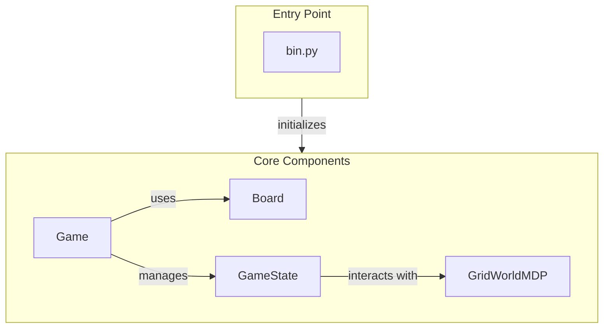

# GridWorld Environment

## Overview
The GridWorld Environment module is designed for creating and managing customizable grid-based environments tailored for reinforcement learning applications. It provides a structured framework that allows developers to define the layout of the grid, manage game states, and implement the logic necessary for simulating agent interactions within the environment. This module is particularly useful for researchers and practitioners in reinforcement learning who require a flexible and interactive platform to test algorithms and strategies in a controlled setting.

Developers would use this module when they need to simulate grid-based environments for reinforcement learning tasks, allowing for the customization of parameters such as noise levels, rewards, and agent behaviors. The modular design facilitates easy integration with various reinforcement learning algorithms, making it an ideal choice for experimentation and development.

## Architecture & Design
The GridWorld Environment module employs a structured design pattern that separates concerns across different components, including the board layout, game state management, and decision-making processes. Key abstractions include the `Board`, `Game`, `GameState`, and `GridWorldMDP` classes, each responsible for distinct aspects of the environment.

### Data Flow
1. The `bin.py` file serves as the entry point for configuring and initiating the GridWorld environment based on user-defined parameters.
2. The `Board` class manages the grid layout and terminal values, while the `Game` class orchestrates the overall game flow.
3. The `GameState` class encapsulates the current state of the game, tracking agent performance and interactions.
4. The `GridWorldMDP` class implements the Markov Decision Process, handling state transitions and rewards.



## Key Components

### Main Classes
- **Board**
  - **Responsibilities:** Represents the GridWorld layout, manages terminal values, and supports Q-Value displays.
  - **Key Methods:**
    - `__init__`: Initializes the board with optional Q-Values and policies.
    - `is_terminal_position`: Checks if a position is terminal.
    - `to_dict`: Converts the board state to a dictionary for serialization.

- **Game**
  - **Responsibilities:** Manages the game state and progression, utilizing a Markov Decision Process for action processing.
  - **Key Methods:**
    - `get_initial_state`: Initializes and returns a new game state.
    - `process_args`: Updates game configuration based on user input.
    - `_call_state_process_turn_full`: Processes a full turn in the game state.

- **GameState**
  - **Responsibilities:** Manages the state and performance of the reinforcement learning agent.
  - **Key Methods:**
    - `__init__`: Initializes agent attributes and performance metrics.
    - `get_legal_actions`: Retrieves available actions for the agent.
    - `game_complete`: Checks if the game has been won.

- **GridWorldMDP**
  - **Responsibilities:** Implements the Markov Decision Process for state transitions and rewards.
  - **Key Methods:**
    - `__init__`: Initializes the MDP with starting position and parameters.
    - `get_possible_actions`: Determines valid actions for a given state.
    - `get_transitions`: Calculates possible state transitions for an action.

### Important Functions
- **get_additional_ui_options**: Retrieves additional UI options based on command-line arguments.
- **init_from_args**: Initializes components for the GridWorld environment based on parsed command-line arguments.
- **main**: Initiates a game of GridWorld, processing command-line arguments if provided.
- **set_cli_args**: Configures command-line interface arguments for the GridWorld environment.

### Component Interactions
The `bin.py` file initializes the core components of the GridWorld environment, including the `Board`, `Game`, `GameState`, and `GridWorldMDP`. The `Game` class interacts with the `Board` to manage the game layout and uses the `GameState` to track the agent's performance. The `GridWorldMDP` provides the necessary logic for state transitions and rewards, ensuring that the game operates according to the defined rules.

## Usage Examples
### Common Use Cases
- **Setting Up a GridWorld Environment**: Use the `main` function in `bin.py` to start a new game, specifying parameters such as agent type and noise levels through command-line arguments.
- **Customizing the Game Board**: Modify the `Board` class to define specific terminal positions and Q-Values, allowing for tailored gameplay experiences.

### Example Code
```python
from pacai.gridworld.bin import main

if __name__ == "__main__":
    results = main()
    print("Game results:", results)
```

## Important Details
### Configuration Requirements
- Ensure that all necessary dependencies are installed and that the environment is properly set up to run the GridWorld module.
- Command-line arguments must be specified correctly to configure the game environment as desired.

### Caveats
- Be aware of the terminal positions defined in the `Board` class, as they directly impact game outcomes.
- The `GridWorldMDP` class requires proper initialization of the starting position; failure to do so may result in errors during gameplay.

This documentation provides a comprehensive overview of the GridWorld Environment module, detailing its architecture, key components, and usage. By following the outlined examples and guidelines, developers can effectively leverage this module for their reinforcement learning projects.