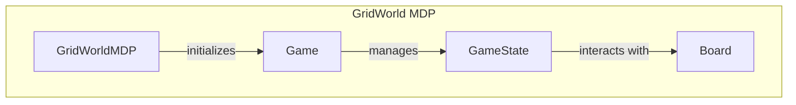

# Decision-Making Processes

## Overview

The `GridWorldMDP` module is responsible for implementing a Markov Decision Process (MDP) within a grid-based environment, facilitating decision-making processes in the GridWorld setting. It manages the initialization of game states, valid actions, state transitions, and rewards, ensuring that the MDP operates efficiently and cohesively. Developers would utilize this module when creating grid-based simulations or games that require structured decision-making logic, enabling reinforcement learning agents to interact with the environment effectively.

By encapsulating the logic for state management and transitions, the `GridWorldMDP` class provides a robust framework for simulating various scenarios in the GridWorld environment. This module is particularly useful for researchers and developers working on reinforcement learning algorithms, as it allows for easy integration of decision-making processes into their applications.

## Architecture & Design

The `GridWorldMDP` module employs a structured approach to manage the decision-making processes through the use of classes that encapsulate specific functionalities. Key abstractions include the `GridWorldMDP`, `Game`, `GameState`, and `Board` classes, each responsible for different aspects of the game environment. The data flow primarily involves interactions between these classes to initialize game states, process actions, and manage transitions.

## Key Components

### Main Classes

- **GridWorldMDP**
  - **Responsibilities**: Implements the MDP for the grid environment, managing state initialization, valid actions, state transitions, and rewards.
  - **Key Methods**:
    - `__init__`: Initializes the MDP with starting position, noise, and living reward.
    - `get_starting_state`: Retrieves the starting state of the MDP.
    - `get_possible_actions`: Determines valid actions for a given state.

- **Game**
  - **Responsibilities**: Manages the overall game state and progression, utilizing the MDP for action processing.
  - **Key Methods**:
    - `get_initial_state`: Initializes and returns a new game state.
    - `process_args`: Updates game configuration based on input arguments.
    - `_call_state_process_turn_full`: Processes actions within the game state.

- **GameState**
  - **Responsibilities**: Manages the state and performance of the reinforcement learning agent, including win status and policies.
  - **Key Methods**:
    - `__init__`: Initializes agent attributes related to game performance.
    - `get_legal_actions`: Retrieves legal actions available to the agent.
    - `game_complete`: Determines if the game has been won.

- **Board**
  - **Responsibilities**: Represents the GridWorld environment, managing layout and terminal values.
  - **Key Methods**:
    - `__init__`: Initializes the board layout and terminal values.
    - `is_terminal_position`: Checks if a position is terminal.
    - `to_dict`: Converts the board state to a dictionary for serialization.

### Important Functions

- **get_additional_ui_options**: Retrieves additional user interface options based on command-line arguments.
- **init_from_args**: Initializes components for the GridWorld environment based on parsed command-line arguments.
- **main**: Initiates a game of GridWorld, processing command-line arguments if provided.

### Component Interactions

The `GridWorldMDP` class interacts with the `Game` class to manage the game state and transitions. The `GameState` class provides the necessary context for the agent's actions, while the `Board` class manages the visual representation of the grid environment. Together, these components work in tandem to create a cohesive decision-making framework for the GridWorld environment.

## Usage Examples

### Common Use Cases

1. **Initializing a GridWorld Environment**: 
   Developers can use the `GridWorldMDP` class to set up a new grid environment by specifying parameters such as starting position, noise levels, and living rewards.

2. **Processing Actions**: 
   The `Game` class can be utilized to manage player actions, leveraging the MDP to determine valid transitions and rewards based on the current game state.

### Integration Points

To integrate the `GridWorldMDP` module into a project, developers can instantiate the `GridWorldMDP` class and use its methods to retrieve starting states, validate actions, and manage transitions. The `Game` class can be employed to handle the overall game logic, while the `GameState` class tracks the agent's performance and state.

## Important Details

### Configuration or Setup Requirements

- Ensure that the grid layout and terminal values are properly defined in the `Board` class to facilitate accurate state transitions and rewards in the `GridWorldMDP`.
- Command-line arguments should be configured correctly to initialize the environment using the `init_from_args` function.

### Caveats and Important Notes

- The `GridWorldMDP` class raises errors if the starting position is not initialized or if invalid states are accessed, so proper validation is essential.
- The interaction between the `Game` and `GameState` classes is crucial for maintaining the integrity of the game flow, and developers should ensure that state updates are handled appropriately to avoid inconsistencies.

By understanding the architecture and key components of the `GridWorldMDP` module, developers can effectively implement decision-making processes in their grid-based applications, leveraging the robust functionalities provided by this module.