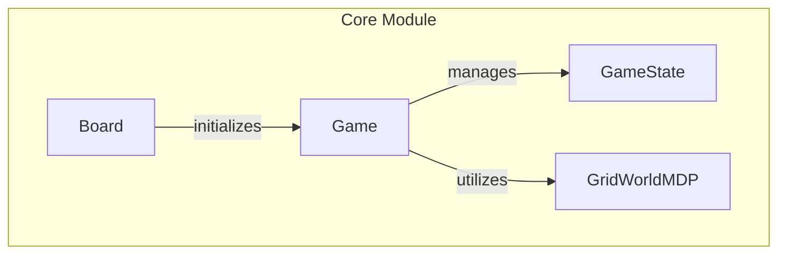

# Environment Layout Handling

## Overview
The `pacai.gridworld` module is responsible for defining and managing the layout of the GridWorld environment through the `Board` class. This module allows developers to create interactive grid-based environments that are essential for simulating various scenarios in reinforcement learning and game design. The `Board` class provides functionalities for initializing the grid, processing input, and managing terminal states, making it a crucial component for applications that require dynamic grid representations.

Developers would use this module when they need to implement a grid-based environment for reinforcement learning agents or when designing games that require a structured layout. The `Board` class's ability to serialize and deserialize its state enhances its usability in scenarios where the environment needs to be saved and restored.

## Architecture & Design
The `pacai.gridworld` module employs a structured approach to manage the GridWorld environment, utilizing key design patterns such as encapsulation and separation of concerns. The `Board` class serves as the central abstraction, managing the layout and terminal values while interacting with other components like `Game`, `GameState`, and `GridWorldMDP`.

### Key Design Patterns
- **Encapsulation**: The `Board` class encapsulates all functionalities related to the grid layout, ensuring that the internal state is managed without exposing unnecessary details.
- **Separation of Concerns**: Each class in the module has a distinct responsibility, allowing for easier maintenance and scalability.

### Data Flow
The data flow within the module is primarily centered around the interaction between the `Board`, `Game`, and `GameState` classes. The `Board` initializes the layout, while the `Game` class manages the overall game state and player actions. The `GameState` class tracks the performance of agents within the game.



## Key Components

### Main Classes
- **Board**: Represents the GridWorld environment, managing layout and terminal values. Key methods include:
  - `__init__`: Initializes the board layout and terminal values.
  - `is_terminal_position`: Checks if a position is terminal.
  - `to_dict`: Serializes the board state to a dictionary.

- **Game**: Manages the state and progression of the game. Key methods include:
  - `get_initial_state`: Initializes and returns the starting game state.
  - `process_args`: Updates game configuration based on user input.
  - `_call_state_process_turn_full`: Processes player actions within the game state.

- **GameState**: Tracks the state and performance of reinforcement learning agents. Key methods include:
  - `__init__`: Initializes agent attributes.
  - `get_legal_actions`: Retrieves legal actions available to the agent.
  - `game_complete`: Checks if the game has been won.

- **GridWorldMDP**: Implements the Markov Decision Process for the grid. Key methods include:
  - `__init__`: Initializes the MDP with parameters.
  - `get_possible_actions`: Determines valid actions for a given state.
  - `get_transitions`: Calculates possible state transitions based on actions.

### Important Functions
- **get_additional_ui_options**: Retrieves additional UI options based on command-line arguments.
- **init_from_args**: Initializes components for the GridWorld environment based on parsed command-line arguments.
- **main**: Initiates a game of GridWorld, processing command-line arguments if provided.

### Component Interaction
The `Board` class interacts with the `Game` class to set up the environment, while the `Game` class utilizes the `GameState` to manage the agent's performance. The `GridWorldMDP` class is used by `Game` to handle the decision-making process, ensuring that the game operates under the principles of a Markov Decision Process.

## Usage Examples

### Common Use Cases
1. **Creating a GridWorld Environment**: To set up a new GridWorld, instantiate the `Board` class with the desired layout and terminal values.
2. **Running a Game**: Use the `Game` class to manage gameplay, allowing for player actions and state transitions.

### Example Code
```python
from pacai.gridworld.board import Board
from pacai.gridworld.game import Game

# Initialize the board with a specific layout
board = Board(layout="layout.txt", qdisplay=True)

# Start a new game with the initialized board
game = Game(board=board)
initial_state = game.get_initial_state()
```

## Important Details

### Configuration Requirements
- Ensure that the layout file for the `Board` class is correctly formatted and accessible.
- Command-line arguments must be parsed correctly to configure the game environment.

### Caveats
- The `Board` class requires careful management of terminal values to ensure that the game logic functions correctly.
- Serialization methods (`to_dict` and `from_dict`) should be used judiciously to maintain the integrity of the game state during save and load operations.

This documentation provides a comprehensive overview of the `pacai.gridworld` module, focusing on the `Board` class and its role in managing the GridWorld environment. By understanding the architecture, key components, and usage examples, developers can effectively utilize this module in their projects.