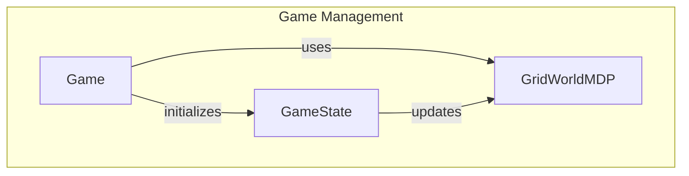

# Game State Management

## Overview

The `Game` and `GameState` classes within the `pacai.gridworld` module are integral to managing the state of the GridWorld environment. The `Game` class orchestrates the overall flow of the game, handling initialization, player actions, and game configuration. In contrast, the `GameState` class focuses on the specifics of the game state, including the performance of reinforcement learning agents, win status, and visual representations of the game elements.

Developers would use this module when implementing or extending grid-based games that require robust state management and interaction with reinforcement learning agents. It provides a structured approach to managing game states, making it easier to develop complex game logic and enhance user experience.

## Architecture & Design

The module employs a structured design pattern that encapsulates game state management through the use of classes. The `Game` class serves as the primary interface for game operations, while the `GameState` class encapsulates the details of the current game state, including agent interactions and visual updates. The `GridWorldMDP` class underpins the decision-making process using a Markov Decision Process (MDP), facilitating state transitions and action processing.

### Data Flow

1. The `Game` class initializes the game state and processes player actions.
2. The `GameState` class manages the current state, including agent performance and visual updates.
3. The `GridWorldMDP` class handles state transitions and rewards based on the actions taken.



## Key Components

### Main Classes

#### Game
- **Location:** `pacai/gridworld/game.py`
- **Responsibilities:** Manages the overall game state and progression, initializes game conditions, processes player actions, and maintains configuration through an `extra_info` dictionary.
- **Key Methods:**
  - `get_initial_state`: Initializes and returns a new `GameState`.
  - `process_args`: Updates game configuration based on provided arguments.
  - `_call_state_process_turn_full`: Processes a full turn in the game state.

#### GameState
- **Location:** `pacai/gridworld/gamestate.py`
- **Responsibilities:** Manages the state and performance of reinforcement learning agents, including win status, policies, and Q-values.
- **Key Methods:**
  - `__init__`: Initializes agent attributes related to game performance.
  - `get_legal_actions`: Retrieves a list of legal actions based on the agent's current position.
  - `game_complete`: Determines if the game is complete based on the agent's win status.

#### GridWorldMDP
- **Location:** `pacai/gridworld/mdp.py`
- **Responsibilities:** Implements the Markov Decision Process for the grid environment, managing state transitions and rewards.
- **Key Methods:**
  - `__init__`: Initializes the MDP with starting position and parameters.
  - `get_possible_actions`: Determines valid actions for a given state.
  - `get_transitions`: Calculates possible state transitions for a given action.

### Important Functions

- **`get_additional_ui_options`**: Retrieves additional UI options based on command-line arguments.
- **`init_from_args`**: Initializes components for the GridWorld environment from command-line arguments.
- **`main`**: Initiates a game of GridWorld, processing command-line arguments if provided.

### Component Interactions

The `Game` class interacts with `GameState` to manage the current state of the game and with `GridWorldMDP` to facilitate decision-making processes. The `GameState` class updates its state based on actions processed by the `Game` class, while also providing feedback on the agent's performance and legal actions available.

## Usage Examples

### Common Use Cases

1. **Initializing a Game**: Use the `Game` class to set up a new game instance, configure settings, and start gameplay.
2. **Agent Interaction**: Utilize the `GameState` class to manage agent actions and track performance metrics during gameplay.

### Example Code

```python
from pacai.gridworld.game import Game

# Initialize a new game
game = Game()
initial_state = game.get_initial_state()

# Process player actions
while not initial_state.game_complete():
    action = get_player_action()  # Assume this function gets the player's action
    game._call_state_process_turn_full(action)
```

## Important Details

### Configuration Requirements

- Ensure that the command-line arguments are correctly set up for the `Game` class to initialize the game environment properly.
- The `GridWorldMDP` requires valid starting positions and parameters to function correctly.

### Caveats

- The `GameState` class's methods assume that the game state is properly initialized before being accessed.
- Modifications to the `extra_info` dictionary in the `Game` class should be done with care to avoid unintended side effects on game behavior.

This module provides a comprehensive framework for managing the state of grid-based games, offering flexibility and extensibility for developers working with reinforcement learning and game design.