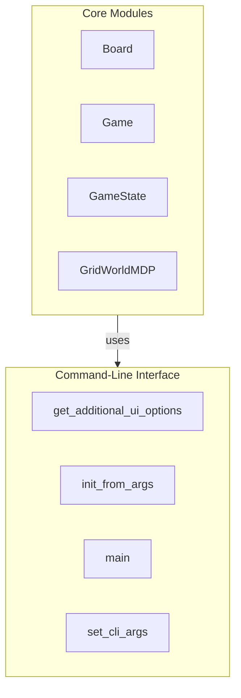

# GridWorld Overview

## Introduction

GridWorld is a customizable environment designed for reinforcement learning simulations. It provides a structured framework for developing and testing algorithms that enable agents to learn optimal behaviors through interactions within a grid-based world. The primary goal of this project is to facilitate the exploration of reinforcement learning concepts by providing a versatile platform where users can configure various parameters and observe the resulting agent behaviors.

This project is aimed at researchers, educators, and developers interested in reinforcement learning. It serves as a practical tool for understanding the dynamics of decision-making processes in grid environments, allowing users to experiment with different configurations and visualize the outcomes of their algorithms.

## Architecture Overview

The GridWorld architecture is composed of several key components that work together to create a cohesive simulation environment. The primary modules include `Board`, `Game`, `GameState`, and `GridWorldMDP`, each serving a distinct purpose within the overall system. The `Board` class manages the visual representation and layout of the grid, while the `Game` class orchestrates the flow of the game, handling state transitions and player actions. The `GameState` class encapsulates the current state of the game, including agent performance and environmental conditions. Lastly, the `GridWorldMDP` class implements the Markov Decision Process, providing the underlying logic for state transitions and rewards.

The design of GridWorld emphasizes modularity and separation of concerns, allowing for easy customization and extension. Each module is responsible for specific functionalities, promoting a clear structure that enhances maintainability and scalability. This architecture supports the integration of new features and the experimentation with different reinforcement learning strategies.

## Key Modules

### Board
The `Board` module is responsible for managing the layout of the GridWorld environment. It handles terminal values, displays Q-Values and policies, and provides methods for initializing and interacting with the grid. This module is crucial for visualizing the state of the environment and facilitating user interactions.

### Game
The `Game` module manages the overall progression of the game, utilizing a structured approach to handle game states and player actions. It integrates with the `GameState` and `GridWorldMDP` modules to ensure a seamless flow from game setup to gameplay execution. This module is essential for orchestrating the interactions between the agent and the environment.

### GameState
The `GameState` module encapsulates the current state of the game, tracking agent performance and game conditions. It provides methods for processing agent actions and updating visual representations of the game elements. This module is integral to maintaining the dynamic nature of the game and facilitating agent interactions.

### GridWorldMDP
The `GridWorldMDP` module implements the Markov Decision Process for the grid environment. It manages state transitions, valid actions, and rewards, ensuring that the decision-making logic is efficiently encapsulated. This module is critical for simulating the agent's learning process and providing the necessary framework for reinforcement learning algorithms.

### Command-Line Interface
The CLI module consists of functions that facilitate user interaction with the GridWorld environment. It includes methods for configuring command-line arguments, initializing the environment based on user input, and starting the game. This module enhances the usability of the GridWorld system, allowing users to customize their experience easily.

## Getting Started

New contributors should start by familiarizing themselves with the `Board`, `Game`, and `GameState` classes, as these are fundamental to understanding the core functionality of the GridWorld environment. The `bin.py` file is also essential, as it provides the entry point for configuring and initiating the environment.

To begin contributing, it is recommended to explore the `__init__.py` and `__main__.py` files for insights into the package structure and execution flow. Understanding these components will provide a solid foundation for navigating the codebase and implementing new features or modifications.