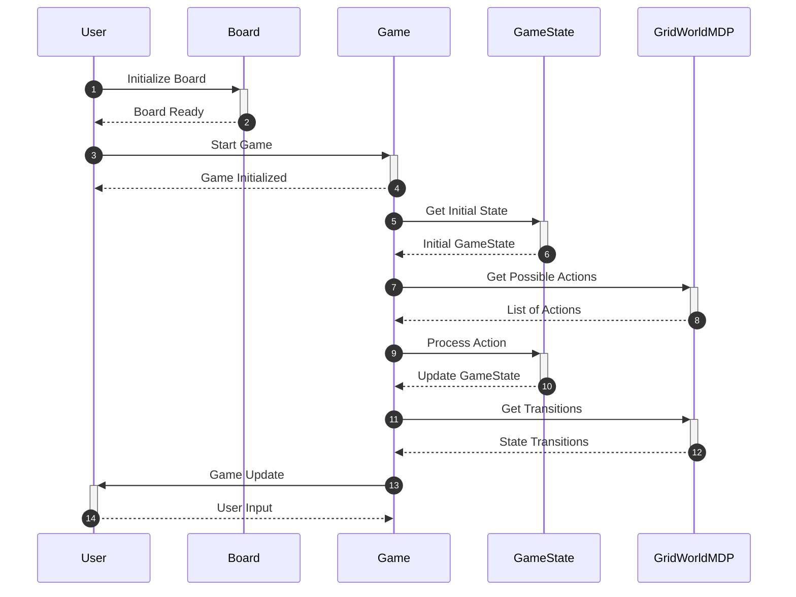

# Using the GridWorld Environment

This guide provides a practical overview of how to configure and run simulations in the GridWorld environment. It is designed for developers who are familiar with Python and want to leverage the GridWorld framework for reinforcement learning or game simulations.

## Concepts

The GridWorld environment consists of several key components that work together to facilitate gameplay and simulation. The primary classes include:

- **Board**: Represents the layout of the GridWorld, managing terminal values and displaying Q-Values and policies.
- **Game**: Manages the overall state and progression of the game, utilizing a Markov Decision Process (MDP) for action processing.
- **GameState**: Handles the state and performance of the reinforcement learning agent, including win status and available actions.
- **GridWorldMDP**: Implements the MDP logic for state transitions, rewards, and valid actions in the grid environment.

The following sequence diagram illustrates the typical workflow when running a GridWorld simulation:



## Step-by-Step Guide

### Step 1: Initialize the Board

To start, you need to create an instance of the `Board` class. This sets up the layout of your GridWorld environment.

```python
from pacai.gridworld.board import Board

board = Board()
```

### Step 2: Start the Game

Next, create an instance of the `Game` class to manage the game state. This will initialize the game and prepare it for player actions.

```python
from pacai.gridworld.game import Game

game = Game()
```

### Step 3: Get the Initial Game State

Use the `get_initial_state` method from the `Game` class to retrieve the starting state of the game. This will provide you with a `GameState` object.

```python
initial_state = game.get_initial_state()
```

### Step 4: Process Player Actions

To allow player interactions, you will need to process actions using the `GameState` class. This can be done by calling the `get_legal_actions` method to retrieve available actions based on the current state.

```python
legal_actions = initial_state.get_legal_actions()
```

### Step 5: Update the Game State

Once an action is chosen, you can update the game state by calling the `_call_state_process_turn_full` method from the `Game` class.

```python
game._call_state_process_turn_full(action)
```

### Step 6: Handle Game Updates

After processing actions, you can retrieve the updated game state and provide feedback to the user.

```python
# Update the game state and display results
print(initial_state)
```

## Examples

### Example: Running a Simple Game

Here’s a simple example that demonstrates how to set up and run a GridWorld game:

```python
from pacai.gridworld.board import Board
from pacai.gridworld.game import Game

# Step 1: Initialize the Board
board = Board()

# Step 2: Start the Game
game = Game()

# Step 3: Get the Initial Game State
initial_state = game.get_initial_state()

# Step 4: Process Player Actions
legal_actions = initial_state.get_legal_actions()
action = legal_actions[0]  # Choose the first legal action

# Step 5: Update the Game State
game._call_state_process_turn_full(action)

# Step 6: Handle Game Updates
print(initial_state)
```

## Common Pitfalls

- **Incorrect Board Initialization**: Ensure that the `Board` is properly initialized before starting the game. An uninitialized board can lead to runtime errors.
- **Invalid Actions**: Always check for legal actions before processing them. Attempting to execute an illegal action will disrupt the game flow.
- **State Management**: Be mindful of the game state updates. Failing to update the state after an action can result in outdated information being displayed to the user.

By following this guide, you should be able to effectively configure and run simulations in the GridWorld environment, leveraging its classes and methods for your projects.