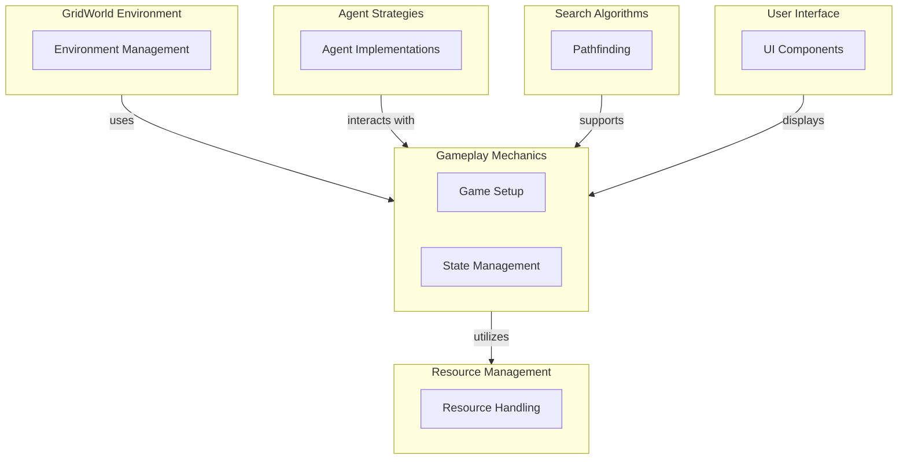

# Project Overview

## Introduction
Pacai is a Python-based project designed to create and manage customizable environments for reinforcement learning, specifically within game contexts. It addresses the need for structured environments and agent strategies that facilitate the development and testing of intelligent agents in various game scenarios. This project is aimed at researchers, developers, and enthusiasts in the fields of artificial intelligence and game development, providing them with the tools to experiment with and implement reinforcement learning algorithms.

## Architecture Overview
The architecture of Pacai is modular, consisting of several key components that interact to provide a comprehensive framework for game development and reinforcement learning. The main components include the GridWorld environment, agent strategies, gameplay mechanics, resource management, search algorithms, and user interface design. Each module serves a specific purpose, allowing developers to focus on individual aspects of game creation while maintaining a cohesive structure.

The design emphasizes separation of concerns, enabling easy maintenance and extensibility. For instance, the GridWorld environment module handles the creation and management of game environments, while the agent strategies module focuses on the implementation of various decision-making algorithms. This modular approach allows for the integration of new features and improvements without disrupting the overall system.

## Key Modules
- **GridWorld Environment**: This module provides the infrastructure for creating and managing customizable GridWorld environments, essential for testing reinforcement learning algorithms.
  
- **Agent Strategies**: Contains various implementations of agents and their decision-making strategies, allowing developers to test different approaches to agent behavior in game environments.

- **Gameplay Mechanics**: Covers the setup of games, management of game states, and user interactions, ensuring a seamless gaming experience.

- **Resource Management**: Manages various resources such as boards, fonts, and spritesheets, which are crucial for the user interface and overall game aesthetics.

- **Search Algorithms**: Facilitates the implementation of search algorithms for pathfinding and navigation tasks, enhancing the capabilities of agents within the game environments.

- **User Interface Design**: Provides components for both graphical and text-based interactions, ensuring that users can effectively engage with the game.

These modules are designed to work together, with clear dependencies and interactions that enhance the overall functionality of the Pacai project.

## Getting Started
New contributors should begin by familiarizing themselves with the **GridWorld Environment** module, as it lays the foundation for creating game environments. Understanding the **Gameplay Mechanics** module is also crucial, as it encompasses the setup and management of game states. Key files to review include those within the `pacai/gridworld` and `pacai/core` directories, as they contain essential classes and functions that drive the project's core functionality. Engaging with the documentation and exploring the examples provided will facilitate a smoother onboarding process for new contributors.