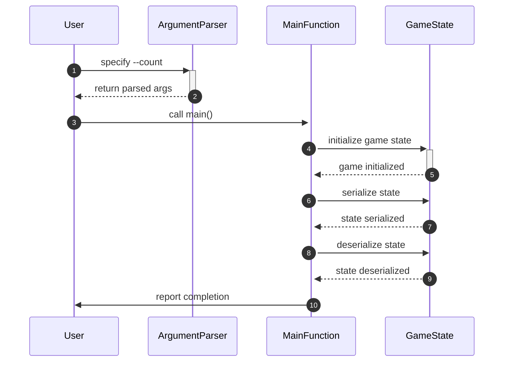

# Performance Testing Guide

This guide will teach you how to profile serialization processes and assess game state management performance using the `serialization_profile.py` module. It is intended for developers working on game systems who want to optimize the efficiency of state management through performance testing.

## Concepts

Performance testing in the context of game state management involves measuring the time and resources required to serialize and deserialize game states. The key functions in this guide are:

- **`_load_args`**: This function sets up command-line arguments for the profiling tool, allowing users to specify the number of iterations to perform.
- **`main`**: This function initializes a game state and executes multiple cycles of serialization and deserialization, reporting the completion of the process.

The following sequence diagram illustrates the typical workflow for profiling serialization:



## Step-by-Step Guide

1. **Set Up Your Environment**
   - Ensure you have the necessary dependencies installed to run the `serialization_profile.py` script.

2. **Load Command-Line Arguments**
   - Use the `_load_args` function to set up your command-line arguments. This allows you to specify the number of iterations for profiling.
   - Example usage:
     ```python
     args = _load_args()
     print(args.count)  # Outputs the number of iterations
     ```

3. **Run the Main Function**
   - Call the `main` function to start the profiling process. This function will initialize the game state and perform the specified number of serialization and deserialization cycles.
   - Example usage:
     ```python
     if __name__ == "__main__":
         main()
     ```
   - This will execute the profiling and print the completion status to the user.

4. **Analyze Results**
   - After running the script, review the output to assess the performance of the serialization and deserialization processes. Look for any bottlenecks or areas for improvement.

## Examples

Here’s a simple example of how to run the profiling script from the command line:

```bash
python serialization_profile.py --count 200
```

This command will execute the serialization and deserialization processes 200 times, allowing you to gather performance metrics for your game state management.

## Common Pitfalls

- **Incorrect Argument Parsing**: Ensure that you specify the `--count` argument correctly. If omitted, the default value of 100 will be used, which may not be suitable for your testing needs.
- **Not Analyzing Output**: After running the profiling, take the time to analyze the output. Simply running the script without reviewing the results can lead to missed optimization opportunities.
- **Ignoring Performance Metrics**: Pay attention to the time taken for serialization and deserialization. If these processes are taking longer than expected, consider optimizing the game state structure or serialization logic.

By following this guide, you can effectively profile and assess the performance of your game's state management, leading to improved efficiency and user experience.