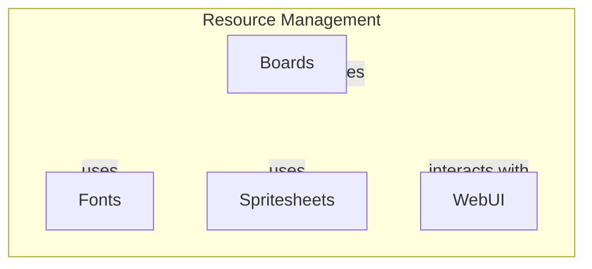

# Resource Management

## Overview
The Resource Management module is responsible for managing various resources essential for user interfaces, including boards, fonts, and spritesheets. This module serves as a centralized hub for organizing and accessing these resources, facilitating the development of user interfaces in applications. Developers would use this module when they need to efficiently manage and utilize graphical assets, ensuring that their applications can render UI components effectively.

## Architecture & Design
The architecture of the Resource Management module is designed to provide a clear structure for managing resources. It employs a modular design pattern, allowing for easy organization and access to different resource types. The module is structured to facilitate the import and export of various components, ensuring that developers can quickly integrate the necessary resources into their applications.

### Data Flow
The data flow within the module is straightforward, with resources being imported from submodules and utilized in the main application logic. The primary components interact through well-defined interfaces, allowing for efficient resource management.



## Key Components

### Main Functions
- **`apiFailure`**: Handles failed API requests by logging error messages and closing the current context. Returns a rejected promise with the response.
- **`apiSuccess`**: Processes successful API responses by extracting JSON data and returning it as a resolved Promise.
- **`close`**: Stops a recurring operation by clearing an interval identified by `intervalID`.
- **`init`**: Initializes the application, fetching configuration data and setting up a recurring update interval.
- **`main`**: Initializes the program by registering keys and performing necessary setup.
- **`makeRequest`**: Makes an HTTP POST request with a JSON-encoded body and returns a promise based on the request outcome.
- **`registerKeys`**: Tracks key presses by adding an event listener to the window.
- **`update`**: Collects pressed keys, sends them to a server, and updates the UI based on the server's response.

### Interaction of Components
The functions within the Resource Management module interact closely, particularly in the context of user input and API interactions. For example, the `init` function sets up the application state, while `registerKeys` tracks user inputs. The `update` function then utilizes this input to communicate with the server, demonstrating a clear flow of data and functionality.

## Usage Examples
Developers can utilize the Resource Management module in various scenarios, such as initializing a user interface or managing graphical assets. Here are some common use cases:

1. **Initializing the Application**:
   ```javascript
   init();
   ```

2. **Making API Requests**:
   ```javascript
   makeRequest('/api/resource', { key: 'value' })
       .then(apiSuccess)
       .catch(apiFailure);
   ```

3. **Tracking Key Presses**:
   ```javascript
   registerKeys();
   ```

4. **Updating the UI**:
   ```javascript
   update();
   ```

These examples showcase how to leverage the functions within the module to manage resources effectively and interact with the user interface.

## Important Details
### Configuration or Setup Requirements
While the Resource Management module does not specify any complex configuration requirements, it is essential to ensure that the necessary submodules (boards, fonts, spritesheets, and webui) are correctly imported and initialized to utilize the full functionality of the module.

### Caveats
- Ensure that API endpoints are correctly defined and accessible to avoid issues with the `makeRequest` function.
- Be mindful of the state management when using the `update` function, as it relies on the current state of pressed keys and server responses.

This documentation provides a comprehensive overview of the Resource Management module, detailing its architecture, key components, usage examples, and important considerations for developers.