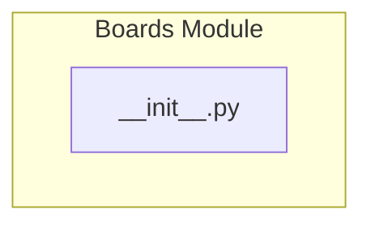

# Managing Boards

## Overview
The `pacai.resources.boards` module is responsible for managing board configurations within the application. It serves as a namespace for organizing and initializing board-related functionality, facilitating the import and usage of various components related to board management. Developers would utilize this module when they need to configure, access, or manipulate boards in their applications, ensuring a structured approach to board management.

## Architecture & Design
The architecture of the `pacai.resources.boards` module is designed to provide a clean and organized entry point for board management functionalities. The module does not define any classes or functions directly in the `__init__.py` file but serves to streamline the import process for other components within the package. This design pattern allows for easy scalability and maintainability of the codebase.

### Mermaid Diagram


## Key Components
As the `__init__.py` file does not contain any specific classes or functions, it primarily serves as a namespace for the package. Its role is to facilitate the import of other modules and potentially re-export specific symbols from submodules. This structure aids in maintaining a clean and organized codebase, allowing developers to access board functionalities efficiently.

## Usage Examples
While the `__init__.py` file does not provide direct usage examples due to the absence of defined classes or functions, developers can expect to import components from this module in their applications. For instance, they might use:
```python
from pacai.resources.boards import some_board_function
```
This allows for seamless integration of board management functionalities into their projects.

## Important Details
### Configuration or Setup Requirements
There are no specific configuration or setup requirements mentioned for the `pacai.resources.boards` module. However, developers should ensure that they have the necessary permissions and environment set up to access the package.

### Caveats, Gotchas, or Important Notes
- The `__init__.py` file does not contain any functionality by itself; its purpose is to serve as a namespace.
- Developers should look into the submodules of `pacai.resources.boards` for actual implementations and functionalities related to board management. 

This documentation provides a foundational understanding of the `pacai.resources.boards` module, emphasizing its role in organizing board-related functionalities within the application.