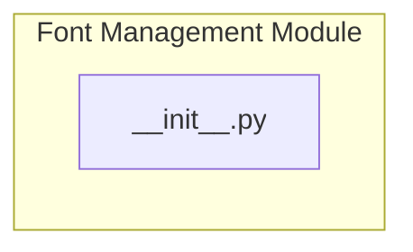

# Font Management and Usage

## Overview
The Font Management and Usage module is responsible for managing fonts within the user interface of applications. It provides functionalities for loading, applying, and customizing font styles, ensuring that developers can easily integrate various font types into their projects. This module is particularly useful when creating visually appealing user interfaces that require specific typography to enhance readability and aesthetics.

Developers would use this module when they need to implement custom fonts in their applications, whether for branding purposes or to improve user experience. By utilizing this module, developers can streamline the process of font management, making it easier to maintain consistency across different components of the user interface.

## Architecture & Design
The Font Management and Usage module is designed with a focus on simplicity and ease of integration. It serves as a namespace that organizes font-related functionalities, allowing developers to access and manage fonts efficiently. The architecture emphasizes modularity, enabling the re-export of symbols from other modules within the package.



### Design Patterns
The module employs a namespace pattern, which allows for the organization of related functionalities without defining additional classes or functions. This design pattern facilitates the import and use of font management features in a straightforward manner.

### Data Flow
The data flow within this module is straightforward, as it primarily serves as an entry point for accessing font management functionalities. The `__init__.py` file acts as a facilitator for importing and re-exporting symbols from other modules, streamlining the integration process.

## Key Components
### Main Components
- **`__init__.py`**: This file serves as the main entry point for the Font Management module. It does not define any classes or functions but organizes and exposes the contents of the module, allowing for easy access to font management functionalities.

### Important Functions
- The module does not explicitly define any functions or classes in the provided context. Its primary role is to facilitate the import of other modules and re-export symbols, making it easier for developers to access the necessary functionalities for font management.

### Component Interaction
The `__init__.py` file interacts with other modules within the `pacai/resources/fonts/` package by re-exporting their functionalities. This allows developers to access font management features without needing to navigate through multiple files.

## Usage Examples
While specific usage examples are not provided in the context, developers can typically use the Font Management module by importing it into their projects. For instance, a developer might include the following line in their code to access font management functionalities:

```python
from pacai.resources.fonts import *
```

This import statement would allow the developer to utilize any available functions or classes related to font management defined in the package.

## Important Details
### Configuration or Setup Requirements
There are no specific configuration or setup requirements mentioned in the provided context. However, developers should ensure that the `pacai/resources/fonts/` package is correctly installed and accessible within their project environment.

### Caveats
As the `__init__.py` file does not define any specific classes or functions, developers should be aware that they will need to refer to the documentation of other modules within the `pacai/resources/fonts/` package for detailed information on available functionalities. This module primarily serves as an organizational tool rather than a feature-rich component on its own.