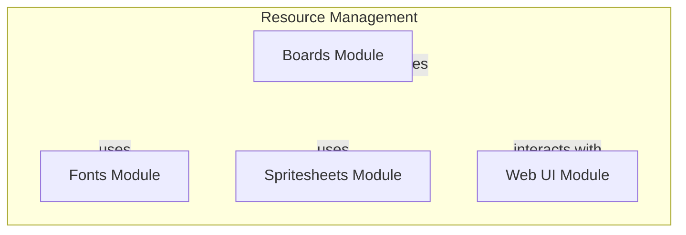

# Resource Management Overview

## Introduction

The resource management system is a critical component of the project, designed to efficiently handle various resources such as boards, fonts, and spritesheets. This system addresses the challenges of organizing and managing these resources, ensuring that they are easily accessible and usable within the application. By streamlining resource management, the project enhances performance and usability, making it more effective for developers and end-users alike.

This project is aimed at developers who need a robust solution for managing graphical resources in their applications. It provides a structured approach to resource handling, allowing for better organization and integration of assets, which is essential for creating visually rich applications.

## Architecture Overview

The resource management system is composed of several key modules, each responsible for managing different types of resources. The main components include:

- **Boards Module**: Responsible for managing board resources, which may include layouts or game boards.
- **Fonts Module**: Handles font resources, allowing for the integration of various text styles within the application.
- **Spritesheets Module**: Manages spritesheets, which are collections of images used for animations and graphical elements.
- **Web UI Module**: Facilitates interactions with the user interface, handling events and API requests.

These modules are organized to promote a clean architecture, where each module serves a specific purpose while remaining interconnected. The design choice of using separate modules allows for better maintainability and scalability, enabling developers to extend functionality as needed.

## Key Modules

### Boards Module
The Boards module is responsible for managing board resources, which may include layouts or configurations for games or applications. It serves as a foundational component that other modules can rely on for board-related functionalities.

### Fonts Module
The Fonts module handles various font resources, allowing developers to easily integrate different text styles into their applications. This module ensures that text rendering is consistent and customizable across the application.

### Spritesheets Module
The Spritesheets module manages collections of images used for animations and graphical elements. By organizing spritesheets effectively, this module enhances the visual performance of the application and simplifies the process of loading and using graphical assets.

### Web UI Module
The Web UI module serves as the interface for user interactions, managing key events and API requests. It plays a crucial role in ensuring that the application responds smoothly to user inputs and updates the UI based on server interactions.

These modules are designed to work together, with the Web UI module interacting with the other resource modules to provide a cohesive user experience.

## Getting Started

New contributors should start by familiarizing themselves with the `pacai/resources/` package, as it contains the core components of the resource management system. The most important files to understand first are the `__init__.py` files in each module, as they provide an entry point for accessing the functionalities of the respective modules.

Additionally, reviewing the `main.js` file in the Web UI module will provide insights into how the application interacts with the user and manages state. Understanding the key functions such as `init`, `registerKeys`, and `update` will be beneficial for grasping the overall flow of the application. By starting with these components, contributors can effectively engage with the resource management system and contribute to its development.