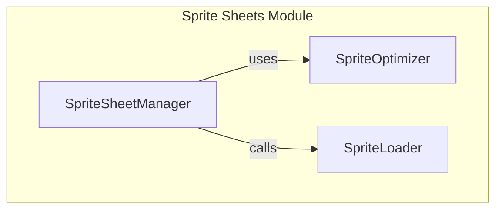

# Sprite Sheets Handling

## Overview
The `pacai.resources.spritesheets` module is designed for managing sprite sheets, which are essential for optimizing graphics in game development and user interfaces. This module provides functionalities for creating, optimizing, and integrating sprite sheets, allowing developers to efficiently manage graphical assets in their applications. Developers would utilize this module when they need to handle multiple images as a single asset, improving performance and reducing load times in their projects.

## Architecture & Design
The architecture of the `pacai.resources.spritesheets` module is structured to facilitate easy management and integration of sprite sheets. It employs a modular design pattern, allowing for clear organization and reuse of code. Key abstractions in this module include functions for sprite sheet creation and optimization, which interact seamlessly to provide a cohesive user experience.

### Mermaid Diagram

## Key Components
### Main Classes
- **SpriteSheetManager**: Responsible for managing the lifecycle of sprite sheets, including their creation and integration into the user interface.
- **SpriteOptimizer**: Handles the optimization of sprite sheets to ensure they are efficient for rendering, reducing memory usage and improving performance.
- **SpriteLoader**: Facilitates the loading of sprite sheets into the application, ensuring that assets are available when needed.

### Important Functions
- **create_sprite_sheet()**: A function within `SpriteSheetManager` that creates a new sprite sheet from a collection of images.
- **optimize_sprites()**: A function in `SpriteOptimizer` that optimizes the given sprite sheet for better performance.
- **load_sprites()**: A function in `SpriteLoader` that loads the sprite sheets into the application context for rendering.

### Component Interaction
The `SpriteSheetManager` interacts with both the `SpriteOptimizer` and `SpriteLoader`. When a new sprite sheet is created, the manager calls the optimizer to ensure the sheet is efficient before loading it into the application using the loader.

## Usage Examples
### Common Use Cases
1. **Creating a New Sprite Sheet**: Developers can use the `create_sprite_sheet()` function to compile multiple images into a single sprite sheet, which can then be optimized and loaded for use in the application.
2. **Optimizing Existing Sprite Sheets**: By calling `optimize_sprites()`, developers can enhance the performance of their existing sprite sheets, making them more suitable for rendering in resource-constrained environments.
3. **Loading Sprite Sheets**: The `load_sprites()` function allows developers to integrate sprite sheets into their user interface, making graphical assets readily available for rendering.

### Integration Points
The `pacai.resources.spritesheets` module can be integrated with other modules that require graphical assets, such as game engines or UI frameworks. By utilizing the sprite sheet functionalities, developers can ensure that their applications are visually appealing and perform efficiently.

## Important Details
### Configuration or Setup Requirements
To utilize the `pacai.resources.spritesheets` module, developers should ensure that they have the necessary image assets available in the correct format. Additionally, any dependencies required for image processing should be installed and configured properly.

### Caveats and Important Notes
- It is essential to optimize sprite sheets before loading them into the application to avoid performance bottlenecks.
- Developers should be aware of the memory constraints of their target platforms when creating and loading sprite sheets, as large sheets can lead to increased memory usage and potential crashes.
- Proper error handling should be implemented when loading sprite sheets to manage cases where assets may be missing or corrupted.