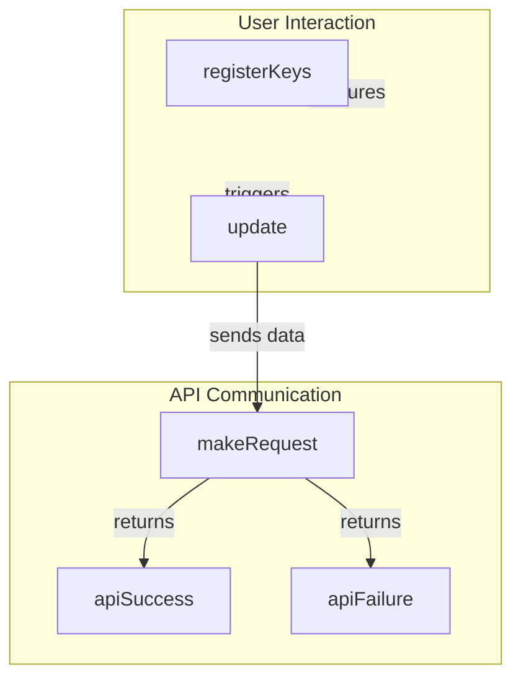

# Web UI Integration

## Overview
The `webui` submodule is designed to enhance user interaction within applications by managing event tracking and facilitating API communication. This module serves as a critical component for developers looking to create responsive web applications that require real-time user input and server interaction. By utilizing this submodule, developers can streamline the process of capturing user events, handling API requests, and updating the user interface based on server responses.

Developers would use the `webui` submodule when building applications that require dynamic user interfaces and real-time data updates. This includes scenarios such as gaming applications, dashboards, or any interactive web application that relies on user input and server communication.

## Architecture & Design
The `webui` submodule employs a modular design pattern that allows for clear separation of concerns. Key functionalities such as event handling, API communication, and UI updates are encapsulated within specific functions, promoting maintainability and scalability.

### Data Flow
1. User interactions (key presses) are captured by the `registerKeys` function.
2. The `update` function sends the collected key data to the server via the `makeRequest` function.
3. Server responses are processed by either `apiSuccess` or `apiFailure`, which handle the success and failure of API requests respectively.
4. The UI is updated based on the server's response.

## Key Components

### Important Functions
- **`apiFailure`**: Handles failed API requests by logging errors and returning a rejected promise.
- **`apiSuccess`**: Processes successful API responses, extracting JSON data and returning it as a resolved promise.
- **`close`**: Stops recurring operations by clearing intervals.
- **`init`**: Initializes the application by fetching configuration data and setting up the UI update interval.
- **`main`**: Entry point that registers keys and performs setup through the `init` function.
- **`makeRequest`**: Makes HTTP POST requests with JSON data and returns a promise.
- **`registerKeys`**: Tracks key presses and stores them in an array.
- **`update`**: Sends pressed keys to the server and updates the UI based on the response.

### Component Interaction
The functions within the `webui` submodule interact closely to provide a seamless user experience. The `main` function initializes the application and sets up event listeners through `registerKeys`. User input is collected and processed by the `update` function, which communicates with the server via `makeRequest`. The responses are handled by `apiSuccess` and `apiFailure`, which dictate the subsequent UI updates or error handling.

## Usage Examples
### Common Use Cases
1. **Real-time Game Input**: Capture user key presses during gameplay and send them to the server for processing.
2. **Dynamic Dashboards**: Update UI elements based on user interactions and server data.

### How to Use
To integrate the `webui` submodule into your application, follow these steps:
1. Import the necessary functions from the `webui` module.
2. Call the `main` function to initialize the application.
3. Use `registerKeys` to start tracking user inputs.
4. Implement the `update` function to handle data submission and UI updates.

### Integration Points
The `webui` submodule can be integrated with other modules that handle backend logic or data processing. Ensure that the server endpoints are configured to handle the requests made by the `makeRequest` function.

## Important Details
### Configuration Requirements
- Ensure that the server endpoints are properly set up to respond to API requests made by the `makeRequest` function.
- Configure the application to handle different response types and errors appropriately.

### Caveats
- The `update` function should be carefully managed to avoid excessive server requests, which could lead to performance issues.
- Proper error handling in `apiFailure` is crucial to maintain a good user experience during API failures.

By understanding the components and interactions within the `webui` submodule, developers can effectively leverage its capabilities to create interactive and responsive web applications.