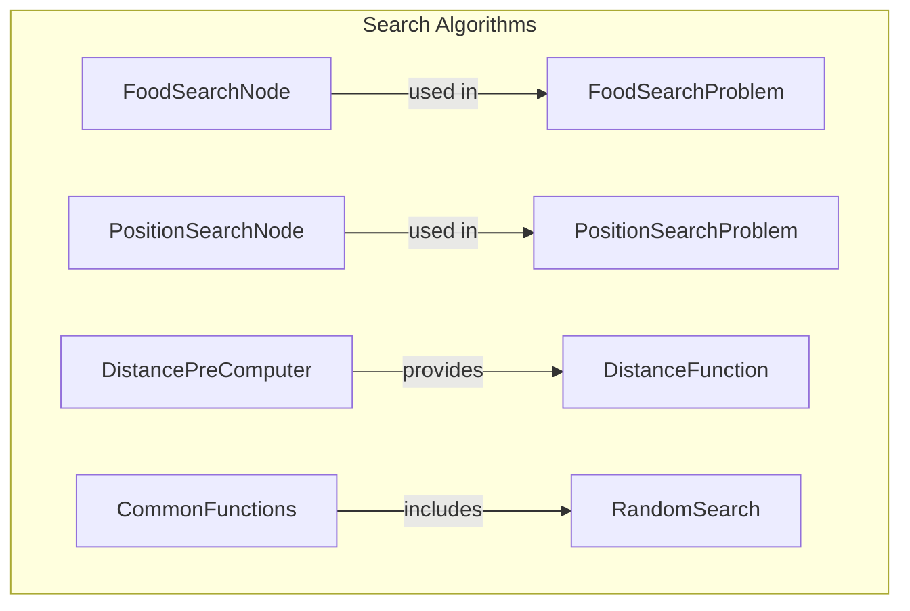

# Search Algorithms

## Overview

The Search Algorithms module is designed to facilitate pathfinding and navigation tasks within game environments. It provides a structured approach to implementing various search strategies, enabling developers to efficiently locate targets, such as food items or specific positions, on a game board. This module is particularly useful in scenarios where agents need to navigate complex environments, such as mazes or grid-based maps, by leveraging different search algorithms and heuristics.

Developers would use this module when implementing game logic that requires intelligent navigation capabilities. By utilizing the provided classes and functions, they can create agents that can dynamically adapt to their surroundings and efficiently find paths to their goals, enhancing the overall gameplay experience.

## Architecture & Design

The Search Algorithms module employs design patterns that focus on encapsulating search logic and state management. Key abstractions include search nodes and search problems, which represent the current state and the overall search context, respectively. The data flow typically involves the generation of successor nodes from a given state, evaluation of costs and heuristics, and the determination of goal states.

## Key Components

### Main Classes

- **FoodSearchNode**: Represents a node in a search algorithm that tracks a specific position and remaining food items. It includes methods for comparison and hashing, facilitating efficient storage and retrieval.

- **FoodSearchProblem**: Manages the state of the food search problem, including the agent's position and goal conditions. It generates successor nodes and tracks the search history.

- **PositionSearchNode**: Encapsulates a position on a board, providing comparison and hashing functionalities to manage nodes in search algorithms.

- **PositionSearchProblem**: Facilitates the search for a specific goal position, managing parameters like start and goal positions, and generating valid successor nodes.

- **DistancePreComputer**: Computes and stores distances between positions on a game board, enhancing efficiency in distance queries.

### Important Functions

- **distance_heuristic**: Calculates a heuristic value based on the distance between a node's position and a problem's goal position.

- **manhattan_distance**: Computes the Manhattan distance between two positions on a grid.

- **maze_distance**: Calculates the maze distance between two positions, accounting for obstacles.

- **random_search**: Executes a random search algorithm to find solutions to search problems.

### Component Interactions

The classes and functions interact to create a cohesive search framework. For instance, `FoodSearchProblem` utilizes `FoodSearchNode` to manage the search state, while `PositionSearchProblem` leverages `PositionSearchNode` for navigating board positions. The `DistancePreComputer` class enhances the efficiency of distance calculations, which are critical for evaluating heuristics in search algorithms. Functions like `manhattan_distance` and `maze_distance` provide the necessary metrics for guiding the search process.

## Usage Examples

### Common Use Cases

1. **Food Search**: Implementing a search algorithm to locate food items in a game environment using `FoodSearchProblem` and `FoodSearchNode`.

2. **Position Navigation**: Utilizing `PositionSearchProblem` and `PositionSearchNode` to navigate to a specific goal position on a board.

3. **Distance Calculations**: Employing `DistancePreComputer` to pre-compute distances for efficient querying during search operations.

### How to Use the Main Classes/Functions

To implement a food search algorithm, a developer would typically instantiate a `FoodSearchProblem` with the initial game state and call methods like `get_successor_nodes` to explore potential paths. For distance calculations, they would create an instance of `DistancePreComputer` and invoke the `compute` method to prepare the distance mappings before querying with `get_distance`.

### Integration Points

The Search Algorithms module can be integrated with other game components, such as rendering systems or user input handlers, to create a responsive and intelligent agent capable of navigating complex environments.

## Important Details

### Configuration or Setup Requirements

To utilize the Search Algorithms module effectively, developers should ensure that the game environment is properly defined, including the layout of obstacles and the initial positions of agents and goals. Additionally, the distance functions should be configured to align with the specific requirements of the game.

### Caveats and Important Notes

- Ensure that the cost functions used in search problems are appropriate for the game mechanics to avoid unintended behaviors.
- Be mindful of the performance implications when using distance calculations in large or complex game environments, as pre-computation can significantly enhance efficiency.
- The `random_search` function may not guarantee optimal solutions, so it should be used in scenarios where exploration is acceptable.

By understanding the architecture and components of the Search Algorithms module, developers can effectively implement intelligent navigation and pathfinding capabilities within their game environments.