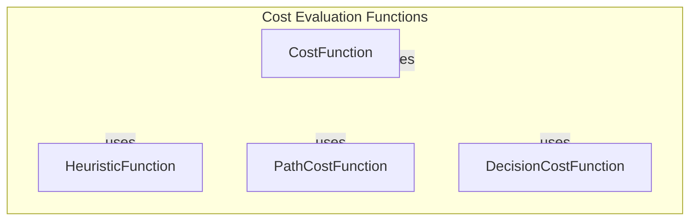

# Cost Evaluation Functions

## Overview

The `pacai/search/common.py` module is responsible for providing cost evaluation functions that are essential for search algorithms. These functions are used to evaluate paths and decisions made during the search process, allowing algorithms to determine the most efficient route or action based on defined cost metrics. Developers would utilize this module when implementing search algorithms, such as A* or Dijkstra's algorithm, where pathfinding efficiency is critical.

By leveraging the cost evaluation functions within this module, developers can enhance the performance of their search algorithms, ensuring that they make optimal decisions based on the calculated costs associated with different paths or actions.

## Architecture & Design

The architecture of the `pacai/search/common.py` module is designed around the principles of modularity and reusability. The key abstractions and interfaces allow for flexible integration with various search algorithms. The module employs a straightforward design pattern that emphasizes the separation of concerns, making it easier to maintain and extend.

### Mermaid Diagram



## Key Components

### Main Classes and Their Responsibilities

- **CostFunction**: This class serves as the base for defining various cost functions that can be used in search algorithms. It provides a framework for calculating costs associated with paths or decisions.

- **HeuristicFunction**: This class extends the `CostFunction` and is specifically designed to calculate heuristic costs. Heuristic functions estimate the cost to reach the goal from a given state, which is crucial for guiding search algorithms efficiently.

- **PathCostFunction**: This class is responsible for evaluating the total cost of a path taken in the search process. It aggregates the costs of individual steps along the path to provide a comprehensive cost assessment.

- **DecisionCostFunction**: Similar to `PathCostFunction`, this class evaluates the costs associated with making specific decisions during the search. It helps in determining the most cost-effective actions to take.

### Important Functions

- **calculate_cost()**: A method within the `CostFunction` class that computes the cost based on the provided parameters. This method is fundamental to all cost evaluations.

- **estimate_cost()**: Found in the `HeuristicFunction`, this method estimates the cost to reach the goal from a specific state, aiding in the decision-making process of search algorithms.

- **total_path_cost()**: A method in the `PathCostFunction` that sums up the costs of all steps in a given path, providing a total cost for that path.

- **decision_cost()**: This function in the `DecisionCostFunction` evaluates the cost of making a particular decision, allowing algorithms to weigh different options based on their costs.

### Component Interactions

The components interact through method calls, where the `CostFunction` serves as the foundation for both `HeuristicFunction` and `PathCostFunction`. The `DecisionCostFunction` can utilize the outputs from these classes to inform its evaluations. This modular interaction allows for a flexible and extensible design, enabling developers to implement various cost evaluation strategies as needed.

## Usage Examples

### Common Use Cases

Developers can use the cost evaluation functions in scenarios such as:

- Implementing A* search algorithms where heuristic costs guide the search towards the goal efficiently.
- Evaluating paths in navigation systems to determine the most cost-effective routes.
- Making decisions in game AI where the cost of actions influences the character's behavior.

### How to Use the Main Classes/Functions

To utilize the cost evaluation functions, a developer would typically instantiate the relevant classes and call their methods as follows:

```python
from pacai.search.common import CostFunction, HeuristicFunction, PathCostFunction, DecisionCostFunction

# Create instances of the cost functions
cost_function = CostFunction()
heuristic_function = HeuristicFunction()
path_cost_function = PathCostFunction()
decision_cost_function = DecisionCostFunction()

# Calculate costs
cost = cost_function.calculate_cost(parameters)
heuristic_cost = heuristic_function.estimate_cost(current_state, goal_state)
total_cost = path_cost_function.total_path_cost(path)
decision_cost = decision_cost_function.decision_cost(decision)
```

### Integration Points with Other Modules

The cost evaluation functions can be integrated with various search algorithms implemented in other modules. For instance, an A* algorithm module can leverage the `HeuristicFunction` to guide its search, while the `PathCostFunction` can be used to evaluate paths generated during the search process.

## Important Details

### Configuration or Setup Requirements

There are no specific configuration requirements for using the cost evaluation functions. However, developers should ensure that they have a clear understanding of the parameters required for each function to achieve accurate cost evaluations.

### Caveats, Gotchas, or Important Notes

- Developers should be cautious when defining custom cost functions to ensure they align with the expected behavior of the search algorithm being implemented.
- It is essential to validate the inputs provided to the cost functions to avoid unexpected results or errors during execution.
- Performance may vary based on the complexity of the cost functions used, so profiling and optimization may be necessary for large-scale applications.