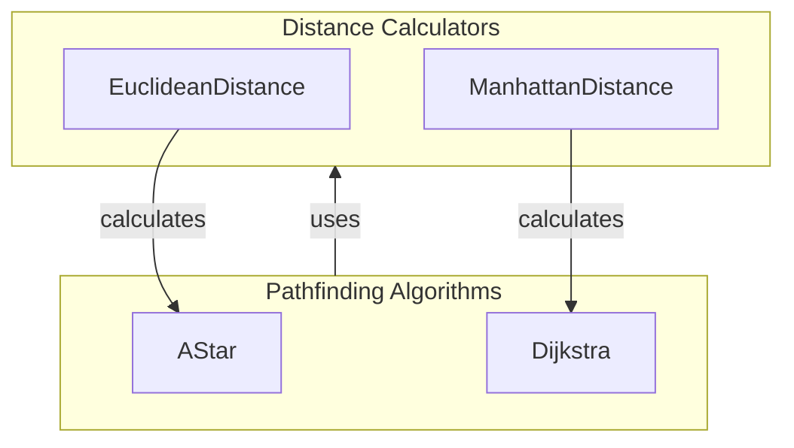

# Distance Calculations for Search

## Overview

The `pacai/search/distance.py` module is responsible for providing various distance calculation methods that are essential for pathfinding and navigation tasks. These methods enable developers to compute distances between points in a search space, which is critical for algorithms that rely on accurate distance metrics to determine optimal paths. 

Developers would use this module when implementing search algorithms, such as A* or Dijkstra's, where understanding the spatial relationships between nodes is crucial for efficient pathfinding. The distance calculations facilitate decision-making in navigation tasks, allowing for the selection of the most efficient routes.

## Architecture & Design

The architecture of the `pacai/search/distance.py` module is designed to support various distance calculation strategies, enabling flexibility and extensibility. The module employs a strategy design pattern, allowing developers to choose different distance metrics based on their specific requirements. 

### Key Abstractions
- **Distance Calculators**: Interfaces or classes that define methods for calculating distances.
- **Pathfinding Algorithms**: Utilize the distance calculators to make informed decisions during the search process.

### Data Flow
The flow of control typically starts with a pathfinding algorithm that requests distance calculations from the distance calculator. The results are then used to evaluate potential paths and make decisions on node traversal.



## Key Components

### Main Classes and Responsibilities

- **EuclideanDistance**: 
  - Responsible for calculating the straight-line distance between two points in a Cartesian coordinate system.
  - Method: `calculate(point1, point2)` - Returns the Euclidean distance between the two points.

- **ManhattanDistance**: 
  - Computes the distance between two points based on a grid-like path, summing the absolute differences of their Cartesian coordinates.
  - Method: `calculate(point1, point2)` - Returns the Manhattan distance between the two points.

### Important Functions

- **calculate**: 
  - A common method in both distance classes that takes two points as input and returns the computed distance based on the respective distance metric.

### Interaction Between Components

The pathfinding algorithms, such as A* and Dijkstra, interact with the distance calculators by invoking their `calculate` methods to obtain the necessary distance metrics. This interaction allows the algorithms to evaluate potential paths and make informed decisions based on the computed distances.

## Usage Examples

### Common Use Cases

1. **A* Pathfinding**: 
   - When implementing an A* search algorithm, developers can utilize the `EuclideanDistance` or `ManhattanDistance` classes to calculate the heuristic distance from the current node to the goal node.

2. **Grid Navigation**: 
   - In scenarios where movement is restricted to grid-based paths, the `ManhattanDistance` class is particularly useful for calculating distances.

### How to Use the Main Classes

```python
from pacai.search.distance import EuclideanDistance, ManhattanDistance

# Example usage of EuclideanDistance
euclidean = EuclideanDistance()
distance = euclidean.calculate((1, 2), (4, 6))
print(f"Euclidean Distance: {distance}")

# Example usage of ManhattanDistance
manhattan = ManhattanDistance()
distance = manhattan.calculate((1, 2), (4, 6))
print(f"Manhattan Distance: {distance}")
```

### Integration Points with Other Modules

The distance calculation classes are typically integrated with pathfinding modules, allowing for seamless distance computation during search operations. Developers can easily switch between different distance metrics by changing the instantiated class.

## Important Details

### Configuration or Setup Requirements

No specific configuration is required to use the distance calculation classes. They can be instantiated and utilized directly in any pathfinding implementation.

### Caveats and Important Notes

- When using `EuclideanDistance`, ensure that the points provided are in a Cartesian coordinate system for accurate results.
- The `ManhattanDistance` is best suited for grid-based navigation; using it in non-grid scenarios may yield misleading results.
- Performance considerations should be taken into account when choosing a distance metric, as different calculations may have varying computational costs depending on the implementation context. 

This module provides essential tools for distance calculations, enabling effective pathfinding and navigation solutions in various applications.