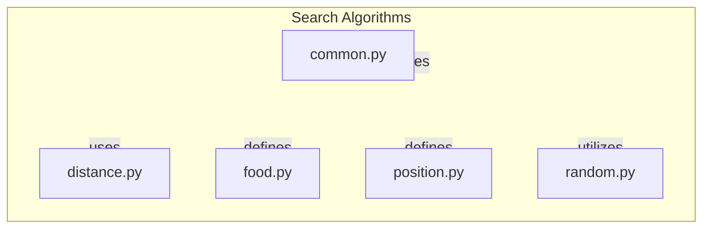

# Overview of Search Algorithms

## Introduction

This project is focused on implementing various search algorithms that facilitate pathfinding and navigation within game environments. It addresses the challenges of efficiently locating targets, such as food items or specific positions on a game board, by utilizing structured search strategies. The project is designed for game developers and researchers interested in enhancing AI navigation capabilities in games, providing them with reusable components and algorithms tailored for effective search operations.

The search algorithms implemented in this project aim to optimize the process of finding paths and solutions in complex environments, such as mazes or grid-based maps. By leveraging different heuristics and distance calculations, the algorithms can adapt to various scenarios, ensuring that agents can navigate efficiently and effectively.

## Architecture Overview

The architecture of the project is organized around several key modules that work together to provide a cohesive search functionality. The main components include modules for distance calculations, common search utilities, specific search problems, and random search implementations. Each module plays a distinct role in the overall system, allowing for modular development and testing.

The `pacai/search` package serves as the core of the project, encapsulating all search-related functionalities. The `common.py` module provides essential cost functions and heuristics that can be reused across different search algorithms. The `distance.py` module focuses on calculating various distance metrics, which are crucial for evaluating paths and guiding search decisions. Specific search problems, such as locating food items or navigating positions, are defined in `food.py` and `position.py`, respectively. Additionally, `random.py` introduces a stochastic approach to searching, allowing for exploration of solutions in a less deterministic manner.

## Key Modules

### pacai/search/common.py
This module provides a collection of cost functions and heuristics that are essential for evaluating the traversal costs associated with search nodes. It includes functions for fixed costs, directional preferences, and a null heuristic, which serves as a baseline for pathfinding. These reusable components are critical for various search strategies, allowing for consistent cost evaluations.

### pacai/search/distance.py
The `distance.py` module is responsible for calculating different types of distances between positions on a game board. It includes the `DistanceFunction` class for evaluating relationships between positions and the `DistancePreComputer` class for pre-computing distances to enhance efficiency. This module supports various distance metrics, such as Manhattan and Euclidean distances, which are vital for guiding search algorithms.

### pacai/search/food.py
This module defines the `FoodSearchNode` and `FoodSearchProblem` classes, which are integral to implementing search algorithms for locating food items within a game environment. The `FoodSearchNode` manages individual search states, while the `FoodSearchProblem` orchestrates the overall search process, enabling agents to effectively find all food items.

### pacai/search/position.py
The `position.py` module contains the `PositionSearchNode` and `PositionSearchProblem` classes, which facilitate the search for specific goal positions within a game state. These classes manage the initialization of search parameters and the generation of valid successor nodes, allowing for efficient exploration of potential paths to reach a goal state.

### pacai/search/random.py
This module provides the `random_search` function, which executes a random search algorithm to identify solutions to search problems. By utilizing a specified heuristic and random number generator, it returns a `SearchSolution` object that includes the sequence of actions taken and the total cost incurred.

## Getting Started

New contributors should begin by familiarizing themselves with the `pacai/search` package, as it contains the core functionalities related to search algorithms. The most important files to understand first are `common.py` and `distance.py`, as they provide foundational cost functions and distance calculations that are widely used across various search implementations.

Once comfortable with these modules, contributors can explore the specific search problems defined in `food.py` and `position.py`, which illustrate how to implement search strategies tailored to different scenarios. Understanding the `random.py` module will also be beneficial for those interested in stochastic search methods. By grasping these key components, contributors will be well-equipped to enhance and extend the search capabilities of the project.