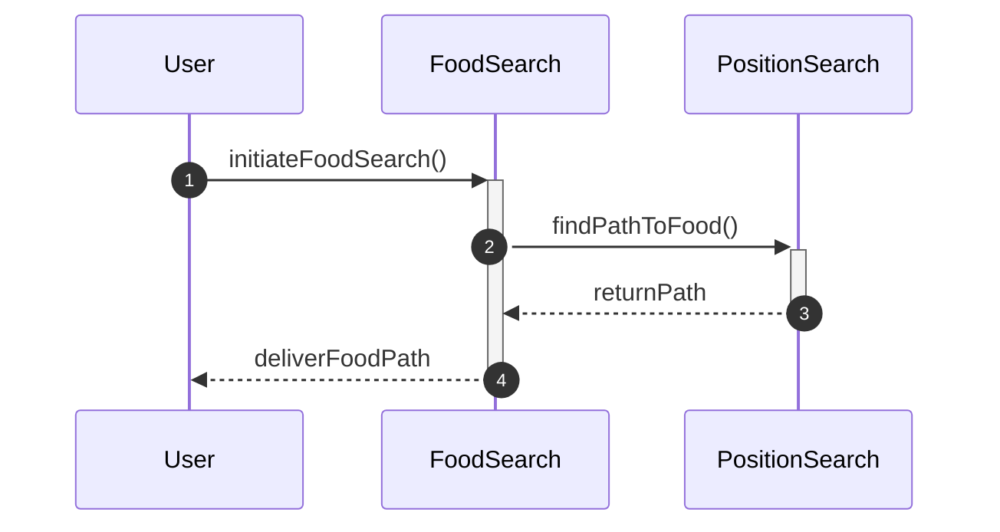

# Implementing Search Problems

This guide will teach you how to implement specific search problems, such as food retrieval and position navigation, using the provided modules in the `pacai` library. It is designed for developers familiar with Python who want to integrate search functionalities into their applications.

## Concepts

Before diving into implementation, it's essential to understand the key components involved in the search problems. The two primary modules we will focus on are:

- `pacai/search/food.py`: This module handles the logic for food retrieval.
- `pacai/search/position.py`: This module is responsible for position navigation.

The interaction between these modules typically involves a sequence of actions where the search algorithms are invoked to find paths or items based on specific criteria.



## Step-by-Step Guide

### Step 1: Set Up Your Environment

Ensure you have the `pacai` library installed in your Python environment. You can do this by cloning the repository or installing it via pip if available.

### Step 2: Import Required Classes

In your Python script, import the necessary classes from the modules you will be using.

```python
from pacai.search.food import FoodSearch
from pacai.search.position import PositionSearch
```

### Step 3: Initialize the Search Objects

Create instances of the `FoodSearch` and `PositionSearch` classes. This sets up the objects you will use to perform the search operations.

```python
food_search = FoodSearch()
position_search = PositionSearch()
```

### Step 4: Implement Food Retrieval Logic

To implement food retrieval, you will typically call a method on the `FoodSearch` instance. This method will internally use the `PositionSearch` to determine the best path to the food.

```python
path_to_food = food_search.initiateFoodSearch()
```

### Step 5: Handle Position Navigation

If your application requires navigating to a specific position, you can use the `PositionSearch` class directly to find the path to the desired coordinates.

```python
desired_position = (5, 10)  # Example coordinates
path_to_position = position_search.findPath(desired_position)
```

### Step 6: Integrate and Test

Combine the food retrieval and position navigation logic in your application. Ensure to test the paths returned by both searches to verify they meet your requirements.

```python
if path_to_food:
    print("Path to food:", path_to_food)
else:
    print("No path found to food.")

if path_to_position:
    print("Path to position:", path_to_position)
else:
    print("No path found to position.")
```

## Examples

Here’s a simple example demonstrating how to use the `FoodSearch` and `PositionSearch` classes together:

```python
from pacai.search.food import FoodSearch
from pacai.search.position import PositionSearch

# Initialize search objects
food_search = FoodSearch()
position_search = PositionSearch()

# Retrieve path to food
path_to_food = food_search.initiateFoodSearch()
print("Path to food:", path_to_food)

# Navigate to a specific position
desired_position = (3, 7)
path_to_position = position_search.findPath(desired_position)
print("Path to position:", path_to_position)
```

## Common Pitfalls

- **Not Handling No Path Found**: Ensure you check if the returned path is valid before proceeding. Always handle cases where no path is found to avoid runtime errors.
  
- **Incorrect Coordinates**: When using `PositionSearch`, double-check the coordinates you provide. Invalid coordinates can lead to unexpected results or errors.

- **Overlooking Dependencies**: Make sure that any dependencies required by the `FoodSearch` and `PositionSearch` classes are properly set up in your environment.

By following this guide, you should be able to implement food retrieval and position navigation effectively using the `pacai` library.