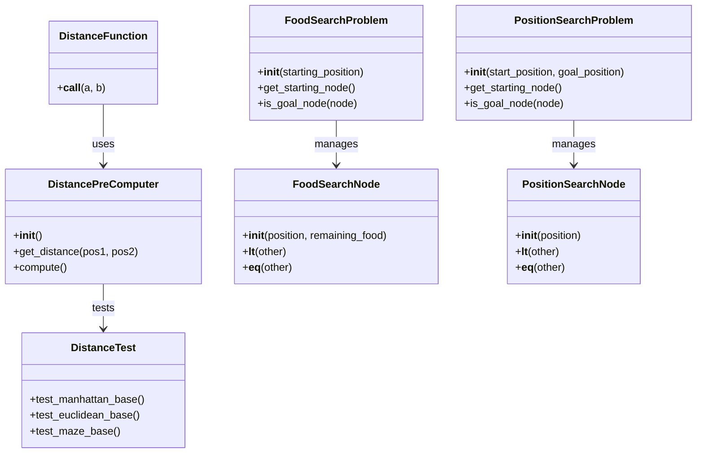

# Testing Search Functionality

This page provides an overview of the APIs available for testing the reliability of distance calculations and search functionalities within the `pacai/search/` module. It covers classes and functions that facilitate the evaluation of search algorithms, including distance metrics and search problem definitions.

## Classes

### DistanceFunction
**Purpose:**  
The `DistanceFunction` class evaluates the relationship between two positions on a game board, providing a score that reflects this interaction.

**Key Methods:**
- `__call__(a, b)`: Evaluates the relationship between positions `a` and `b`, returning a floating-point score.

**Attributes:**  
None explicitly mentioned.

---

### DistancePreComputer
**Purpose:**  
The `DistancePreComputer` class computes and stores distances between positions on a game board, particularly in maze scenarios.

**Key Methods:**
- `__init__()`: Initializes the distance storage for positions on a board.
- `get_distance(pos1, pos2)`: Returns the distance between two positions or None if blocked.
- `get_distance_default(pos1, pos2, default)`: Returns a specified default value if no valid path exists.
- `compute()`: Pre-computes distances for all non-wall positions on the board.
- `_load_identities_and_adjacencies(board)`: Loads identity and adjacency distances for positions.
- `_put_distance(pos1, pos2, distance)`: Stores the distance between two positions.

**Attributes:**  
- `distances`: A dictionary to store computed distances.

---

### DistanceTest
**Purpose:**  
The `DistanceTest` class validates the correctness of various distance calculation methods, including Manhattan, Euclidean, and maze distances.

**Key Methods:**
- `test_manhattan_base()`: Tests the Manhattan distance and heuristic against expected values.
- `test_euclidean_base()`: Validates the Euclidean distance calculations.
- `test_maze_base()`: Checks the accuracy of maze distance calculations.
- `test_distanceprecomputer_base()`: Tests the functionality of the `DistancePreComputer` class.

**Attributes:**  
None explicitly mentioned.

---

### FoodSearchNode
**Purpose:**  
The `FoodSearchNode` class represents a node in a search algorithm that tracks a specific position and remaining food positions.

**Key Methods:**
- `__init__(position, remaining_food)`: Initializes the node with a position and food items.
- `__lt__(other)`: Compares this node with another based on position and remaining food.
- `__eq__(other)`: Checks for equality with another node.
- `__hash__()`: Computes a hash value for the node.

**Attributes:**  
- `position`: The current position of the node.
- `remaining_food`: A sorted tuple of remaining food positions.

---

### FoodSearchProblem
**Purpose:**  
The `FoodSearchProblem` class manages the state of a search problem for locating food items within a game environment.

**Key Methods:**
- `__init__(starting_position)`: Initializes the search problem with the agent's starting position.
- `get_starting_node()`: Returns a `FoodSearchNode` initialized with the starting position.
- `is_goal_node(node)`: Checks if the node has no remaining food items.
- `complete(goal_node)`: Marks the search as complete by updating position history.
- `get_successor_nodes(node)`: Generates successor nodes for a given node.

**Attributes:**  
- `starting_position`: The initial position of the agent.
- `food_positions`: The positions of food items on the board.

---

### PositionSearchNode
**Purpose:**  
The `PositionSearchNode` class represents a node in a search algorithm, encapsulating a specific position on a board.

**Key Methods:**
- `__init__(position)`: Initializes the node with a specified position.
- `__lt__(other)`: Compares this node's position with another.
- `__eq__(other)`: Checks for equality based on position.
- `__hash__()`: Computes a hash value for the node.

**Attributes:**  
- `position`: The position represented by the node.

---

### PositionSearchProblem
**Purpose:**  
The `PositionSearchProblem` class facilitates the search for a specific goal position within a defined game state.

**Key Methods:**
- `__init__(start_position, goal_position)`: Initializes the search problem with start and goal positions.
- `get_starting_node()`: Returns the starting node for the search.
- `is_goal_node(node)`: Checks if the node's position matches the goal.
- `complete(goal_node)`: Records the completion of the search.
- `get_successor_nodes(node)`: Retrieves valid successor nodes from a given node.

**Attributes:**  
- `start_position`: The starting position for the search.
- `goal_position`: The target position to reach.

---

## Functions

### distance_heuristic
**Purpose:**  
Calculates a heuristic value based on the distance between a node's position and a problem's goal position.

**When to Use:**  
Use this function to estimate the cost to reach a goal from a given node in search algorithms.

**Parameters:**
- `node`: The current search node.
- `problem`: The search problem containing the goal position.

**Returns:**  
A float representing the heuristic value or a null heuristic if positions are invalid.

---

### euclidean_distance
**Purpose:**  
Computes the Euclidean distance between two positions.

**When to Use:**  
Use this function when calculating direct distances in grid-based games.

**Parameters:**
- `a`: First position.
- `b`: Second position.

**Returns:**  
A float representing the Euclidean distance.

---

### euclidean_heuristic
**Purpose:**  
Calculates a heuristic value based on the Euclidean distance.

**When to Use:**  
Use this function in search algorithms to estimate the cost to reach the goal.

**Parameters:**
- `node`: The current search node.
- `problem`: The search problem.

**Returns:**  
A float representing the heuristic value.

---

### manhattan_distance
**Purpose:**  
Calculates the Manhattan distance between two positions.

**When to Use:**  
Use this function for grid-based distance calculations where only horizontal and vertical moves are allowed.

**Parameters:**
- `a`: First position.
- `b`: Second position.

**Returns:**  
A float representing the Manhattan distance.

---

### manhattan_heuristic
**Purpose:**  
Computes a heuristic value based on the Manhattan distance.

**When to Use:**  
Use this function in search algorithms to estimate the cost to reach the goal.

**Parameters:**
- `node`: The current search node.
- `problem`: The search problem.

**Returns:**  
A float representing the heuristic value.

---

### maze_distance
**Purpose:**  
Calculates the maze distance between two positions.

**When to Use:**  
Use this function when navigating through maze-like structures in games.

**Parameters:**
- `start`: The starting position.
- `goal`: The goal position.

**Returns:**  
The number of actions required to reach the goal or raises an error if invalid.

---

### random_search
**Purpose:**  
Performs a random search to find a solution to a given search problem.

**When to Use:**  
Use this function when exploring solutions in a stochastic manner.

**Parameters:**
- `problem`: The search problem to solve.
- `heuristic`: The heuristic function to guide the search.
- `random_generator`: The random number generator.

**Returns:**  
A `SearchSolution` containing the sequence of actions taken and the total cost.

---

## Usage Notes

Common patterns for using these APIs include leveraging the `DistancePreComputer` for efficient distance queries in search problems, utilizing `FoodSearchProblem` and `PositionSearchProblem` to define specific search contexts, and employing `DistanceTest` to validate the correctness of distance calculations. The distance functions provide essential metrics that inform the search algorithms, while the node classes encapsulate the state and facilitate comparisons during the search process. Together, these components create a cohesive framework for implementing and testing search functionalities in game environments.