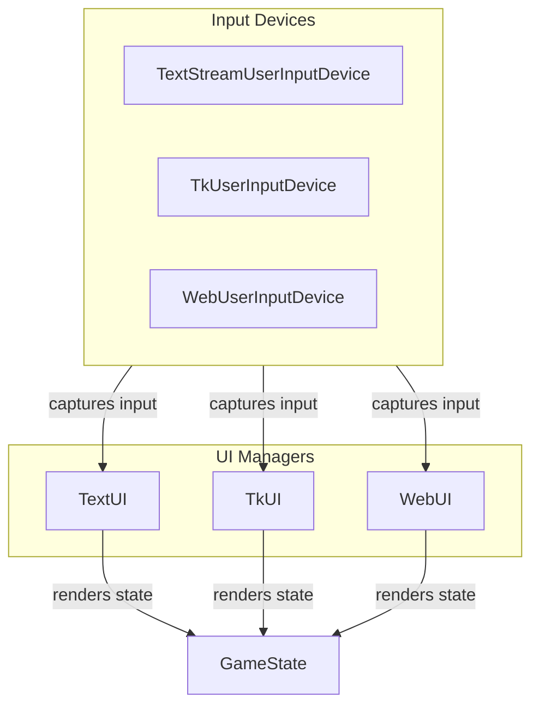

# User Interface Design

## Overview
The `pacai/ui` module is responsible for managing user interface components for both graphical and text-based interactions in games. It provides a structured approach to rendering game states, capturing user inputs, and facilitating interactions through various interfaces, including console, graphical windows, and web-based environments. Developers will find this module useful when they need to implement user interfaces that are responsive and tailored to different platforms, ensuring a seamless gaming experience.

This module encompasses several classes and functions that cater to different interaction styles, including text-based UIs with `TextUI`, graphical UIs using `TkUI`, and web-based UIs with `WebUI`. By utilizing these components, developers can create engaging and interactive experiences that enhance gameplay and user engagement.

## Architecture & Design
The `pacai/ui` module employs various design patterns, including the producer-consumer pattern for input handling and an event-driven model for user interactions in graphical interfaces. Key abstractions include user input devices and UI managers that encapsulate the logic for rendering and user interaction.

### Data Flow
1. User inputs are captured through specific input devices (e.g., `TextStreamUserInputDevice`, `TkUserInputDevice`, `WebUserInputDevice`).
2. The input is processed and translated into actions.
3. The UI classes (e.g., `TextUI`, `TkUI`, `WebUI`) render the game state based on the processed inputs.
4. The game state is updated and displayed to the user.

## Key Components

### Main Classes
- **`NullUI`**: A minimalist UI component that manages visual representation without requiring sprite resources. It provides methods for drawing the game state and indicates that no sprites are needed.
  
- **`TextStreamUserInputDevice`**: Handles real-time input processing in a text-based environment, utilizing a producer-consumer pattern to manage user input from a stream.

- **`TextUI`**: Manages user interaction and visual representation in text-based games, rendering game information and handling user inputs through the `TextStreamUserInputDevice`.

- **`TkUI`**: Responsible for creating and managing a graphical user interface using the Tkinter library. It handles the game window's lifecycle, including initialization and rendering.

- **`WebUI`**: Manages web-based interactions, handling user inputs and HTTP requests while serving game visuals through a web server.

- **`HTTPHandler`**: Manages HTTP requests and responses, specifically for game state data and images in a web application context.

### Important Functions
- **`_cleanup_tk_window`**: Cleans up a specified Tkinter window, updating global variables that track the number of open windows.

- **`_find_open_port`**: Searches for an available network port within a specified range, returning the first open port found.

- **`_handler_init`**: Initializes a request handler, preparing a data dictionary for HTTP interactions.

- **`_run_server`**: Starts an HTTP server on the current thread, ensuring it is ready for connections.

### Component Interactions
The components interact through well-defined interfaces. For instance, the `TextUI` class utilizes the `TextStreamUserInputDevice` to capture user input, which is then processed to update the game state. Similarly, `WebUI` interacts with `HTTPHandler` to manage web requests and responses, ensuring that user actions are captured and reflected in the game state.

## Usage Examples

### Common Use Cases
1. **Text-Based Game**: Use `TextUI` in conjunction with `TextStreamUserInputDevice` to create a console-based game where user inputs are captured and displayed in real-time.
   
2. **Graphical Game**: Implement `TkUI` to create a graphical interface for a game, managing user interactions through keyboard events and rendering the game state visually.

3. **Web-Based Game**: Utilize `WebUI` and `HTTPHandler` to build a web application that allows users to interact with the game through a browser, processing inputs and serving game visuals dynamically.

### Integration Points
- To integrate a text-based UI, instantiate `TextUI` with a `TextStreamUserInputDevice` and call its `draw` method to render the game state.
- For graphical applications, create an instance of `TkUI`, initialize it with game parameters, and manage user inputs through `TkUserInputDevice`.
- In web applications, set up `WebUI` with an `HTTPHandler` to handle incoming requests and serve game visuals.

## Important Details

### Configuration Requirements
- Ensure that the necessary libraries (e.g., Tkinter for `TkUI`) are installed and properly configured in the development environment.
- For web-based applications, ensure that the server environment is set up to handle HTTP requests and that the appropriate ports are open.

### Caveats
- The `NullUI` class does not support sprite rendering, making it suitable only for minimal visual output.
- The frame rate management in `NullUI` is currently unimplemented, which may affect performance in time-sensitive applications.
- The `TextStreamUserInputDevice` relies on threading, which may introduce complexity in managing input states and resource cleanup.

By utilizing the `pacai/ui` module, developers can create versatile user interfaces that cater to various interaction styles, enhancing the overall gaming experience.