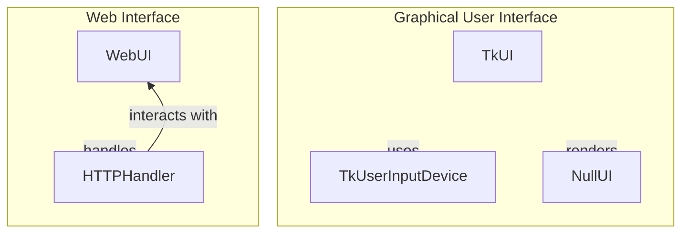

# Graphical Interfaces with Tkinter

## Overview
The `TkUI` module is responsible for creating and managing graphical user interfaces (GUIs) for games using the Tkinter library. It provides a structured approach to handle the lifecycle of a game window, including initialization, rendering, and cleanup, while also managing user interactions through keyboard events. Developers would use this module when they want to implement a graphical interface for their games, leveraging Tkinter's capabilities to create responsive and visually appealing applications.

This module is particularly useful for developers looking to integrate a GUI into their Python games without the overhead of complex frameworks. It allows for easy management of game states and user inputs, making it suitable for both simple and more complex game designs.

## Architecture & Design
The `TkUI` module employs an event-driven design pattern, which is common in GUI applications. This pattern allows the application to respond to user inputs and system events asynchronously. The key abstractions in this module include classes for managing user input (`TkUserInputDevice`), rendering the game interface (`TkUI`), and handling game states.

### Data Flow
The data flow within the module primarily revolves around user inputs being captured, processed, and then reflected in the GUI. User actions are translated into game commands, which update the game state and trigger visual updates in the interface.



## Key Components

### Main Classes
- **TkUI**: Manages the game window's lifecycle, including initialization, rendering, and cleanup. It handles window events and updates the visual representation of the game state.
- **TkUserInputDevice**: Captures and processes keyboard inputs from the Tkinter interface, mapping key events to specific actions.
- **NullUI**: Provides a minimalist interface for rendering the game state without requiring sprite resources, focusing solely on visual output.
- **WebUI**: Manages web-based interactions for games, including server operations and user input handling through a web interface.
- **HTTPHandler**: Handles HTTP requests and responses, managing game state data and images in a web application context.

### Important Functions
- **_cleanup_tk_window**: Cleans up a specified Tkinter window by destroying it and updating global variables related to open windows.
- **_find_open_port**: Searches for an available network port and returns the first open port found.
- **_get_tk_window**: Manages the creation of a Tkinter window, initializing a main window if none exists.
- **_run_server**: Starts an HTTP server on the current thread, ensuring it is ready for connections.

### Component Interactions
The `TkUI` class interacts with `TkUserInputDevice` to capture user inputs, which are then processed and reflected in the game state. The `NullUI` class can be used for simple visual representation when sprite resources are not needed. In the web context, `WebUI` and `HTTPHandler` work together to manage user interactions and serve game visuals over HTTP.

## Usage Examples
### Common Use Cases
1. **Creating a Game Window**: Initialize a `TkUI` instance to create a game window, set its title, and configure dimensions.
2. **Handling User Inputs**: Use `TkUserInputDevice` to map keyboard events to game actions, allowing for real-time interaction.
3. **Rendering Game State**: Call the `draw` method of `TkUI` to update the visual representation of the game based on the current state.

### Example Code Snippet
```python
from pacai.ui.tk import TkUI

# Initialize the TkUI
game_ui = TkUI(title="My Game")

# Start the game
game_ui.game_start(initial_state)

# Main game loop
while game_running:
    game_ui.draw(current_game_state)
```

## Important Details
### Configuration or Setup Requirements
- Ensure that the Tkinter library is installed and properly configured in your Python environment.
- When using the web components, ensure that the necessary networking permissions are granted for HTTP server operations.

### Caveats and Important Notes
- The `NullUI` class does not support sprite rendering, so it should only be used in scenarios where minimal visual output is acceptable.
- The `TkUserInputDevice` relies on the Tkinter event loop, which must be running for input handling to function correctly.
- When integrating with web components, be aware of potential threading issues and ensure that the server is properly managed to avoid resource leaks.

This documentation provides a comprehensive overview of the `TkUI` module, detailing its architecture, key components, usage examples, and important considerations for developers looking to implement graphical interfaces in their Python games.