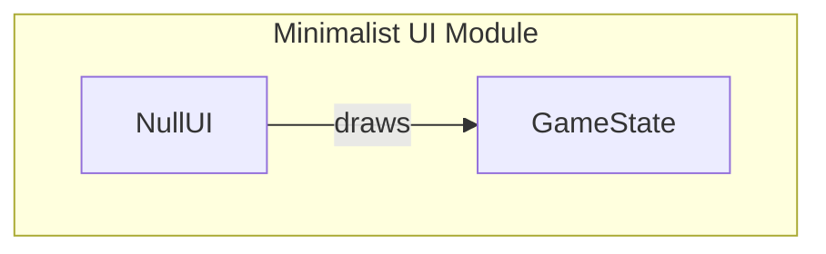

# Minimalist User Interface

## Overview

The Minimalist User Interface module is designed to provide a lightweight and efficient means of rendering game visuals without the complexity of traditional sprite-based systems. At its core, the module features the `NullUI` class, which allows developers to manage the visual representation of a game by rendering the game state in a minimalist fashion. This approach is particularly beneficial in scenarios where a simple visual output is required, such as in prototype development or games with limited graphical demands.

Developers may choose to use this module when they need a straightforward UI solution that minimizes resource overhead. The `NullUI` class is especially useful in game development contexts where performance is critical, and the visual representation can be achieved without the need for extensive sprite resources.

## Architecture & Design

The architecture of the Minimalist User Interface module is centered around the `NullUI` class, which serves as the primary interface for rendering game visuals. The design employs a minimalist approach, focusing on essential functionalities such as drawing the game state and managing frame rates, although frame rate management is not yet implemented. 

### Design Patterns
- **Singleton Pattern**: The `NullUI` class is designed to be instantiated only once, ensuring a single point of control for rendering.
- **Facade Pattern**: The `NullUI` class acts as a facade, providing a simplified interface for rendering without exposing the underlying complexities of sprite management.

### Key Abstractions
- **NullUI**: The main class responsible for rendering the game state.
- **GameState**: Represents the current state of the game, which is passed to the `draw` method of `NullUI`.

### Control Flow
The control flow within the module is straightforward:
1. The game state is updated based on game logic.
2. The `draw` method of `NullUI` is called to render the current game state.



## Key Components

### Main Classes

- **NullUI**
  - **Responsibilities**: Manages the visual representation of the game, renders the game state, and indicates whether sprite resources are required.
  - **Key Methods**:
    - `draw`: Renders the current game state.
    - `requires_sprites`: Returns `False`, indicating no sprite resources are needed.

### Important Functions

The module does not define any additional functions outside of the `NullUI` class. The focus is primarily on the methods within `NullUI` that facilitate rendering.

### Component Interaction

The `NullUI` class interacts primarily with the `GameState` object. The game state is passed to the `draw` method, which is responsible for visual output. This interaction is crucial for updating the visuals based on the current game logic.

## Usage Examples

### Common Use Cases

1. **Prototype Development**: When creating a quick prototype of a game, developers can use `NullUI` to visualize game states without the overhead of sprite management.
2. **Text-Based Games**: In games where visuals are minimal, `NullUI` provides a straightforward way to render game information.

### How to Use `NullUI`

To utilize the `NullUI` class, instantiate it and call the `draw` method with the current `GameState`:

```python
from pacai.ui.null import NullUI
from pacai.core.gamestate import GameState

# Create a NullUI instance
ui = NullUI()

# Create a GameState instance
game_state = GameState()

# Render the game state
ui.draw(game_state)
```

## Important Details

### Configuration Requirements

- Ensure that the `GameState` object is properly initialized and reflects the current state of the game before calling the `draw` method on `NullUI`.

### Caveats

- The `wait_for_fps` method is currently unimplemented, which means frame rate management is not available. Developers should handle frame rate control externally if needed.
- The `requires_sprites` method always returns `False`, which may not be suitable for all game types, especially those that require visual assets.

By leveraging the `NullUI` class, developers can achieve a minimalist approach to game rendering, focusing on essential functionalities without the complexities associated with sprite-based UIs. This module is particularly advantageous for lightweight applications and rapid prototyping in game development.