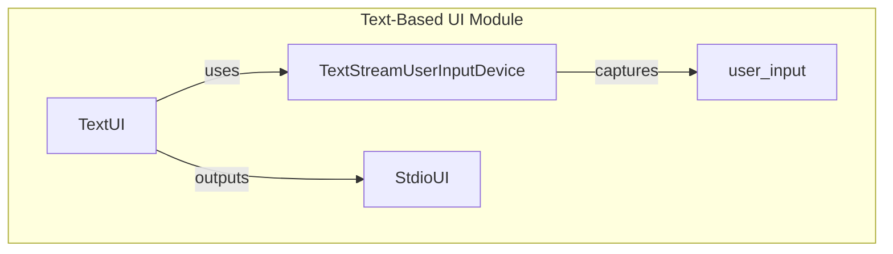

# Text-Based Interfaces

## Overview

The `TextUI` module is responsible for managing text-based input and output in games, facilitating user interaction in a console environment. It provides a structured approach to capturing user input and displaying game information, ensuring a seamless and interactive gaming experience. Developers would use this module when building text-based games or applications that require real-time user interaction through the console, allowing for efficient handling of user commands and game state visualization.

This module includes several key classes, such as `TextUI`, `TextStreamUserInputDevice`, and `StdioUI`, which work together to provide a comprehensive interface for text-based games. By leveraging these classes, developers can create engaging user experiences without the need for complex graphical interfaces, making it suitable for various game genres and educational applications.

## Architecture & Design

The `TextUI` module employs a producer-consumer pattern to manage user input and output streams effectively. The key abstractions include user input devices and the main user interface class, which interact to facilitate real-time data flow. The architecture is designed to separate concerns, allowing for modular development and easier maintenance.

### Design Patterns Used
- **Producer-Consumer Pattern**: Used in `TextStreamUserInputDevice` to handle input processing in a separate thread.
- **Observer Pattern**: Implicitly utilized through the interaction between the game state and the UI components, where changes in the game state trigger updates in the UI.

### Key Abstractions
- **TextUI**: Manages the overall user interface and game state rendering.
- **TextStreamUserInputDevice**: Handles real-time input processing.
- **StdioUI**: Manages standard input and output streams.

### Data Flow
1. User inputs commands via the console.
2. `TextStreamUserInputDevice` captures these inputs and translates them into actions.
3. `TextUI` receives the actions and updates the game state accordingly.
4. The game state is rendered back to the user through the output stream.



## Key Components

### Main Classes and Their Responsibilities

- **TextUI**
  - **Responsibilities**: Manages user interaction and visual representation of the game's state through text-based input and output.
  - **Key Methods**:
    - `__init__`: Initializes the input and output streams.
    - `draw`: Visualizes the current state of the game.
    - `_translate_marker`: Converts game markers into string representations.

- **TextStreamUserInputDevice**
  - **Responsibilities**: Reads user input from a specified stream and maps characters to actions while managing input processing in a separate thread.
  - **Key Methods**:
    - `__init__`: Initializes the input device and starts a monitoring thread.
    - `get_inputs`: Retrieves a list of actions based on captured input.
    - `close`: Properly shuts down the input device.

- **StdioUI**
  - **Responsibilities**: Manages standard input and output streams for user interaction in a console environment.
  - **Key Methods**:
    - `__init__`: Initializes the standard streams for input and output.

### Important Functions

- **_watch_text_stream**: Monitors a text stream for incoming characters and relays each character to a specified queue.
- **_cleanup_tk_window**: Cleans up a specified Tkinter window, though not directly related to text-based interfaces, it is part of the overall UI management.

### Interaction Between Components

The `TextUI` class utilizes `TextStreamUserInputDevice` to capture user inputs, which are then processed and rendered back to the user through the `StdioUI`. This interaction allows for a responsive and dynamic user experience, ensuring that input is captured and reflected in the game state in real-time.

## Usage Examples

### Common Use Cases
- Implementing a text-based adventure game where players input commands to navigate through the game world.
- Creating educational tools that require user interaction through text input.

### How to Use the Main Classes

1. **Initialize the `TextUI`**:
   ```python
   from pacai.ui.text import TextUI, TextStreamUserInputDevice, StdioUI

   input_device = TextStreamUserInputDevice()
   output_device = StdioUI()
   text_ui = TextUI(input_device, output_device)
   ```

2. **Render Game State**:
   ```python
   game_state = ...  # Obtain the current game state
   text_ui.draw(game_state)
   ```

3. **Capture User Input**:
   ```python
   actions = input_device.get_inputs()
   ```

### Integration Points with Other Modules

The `TextUI` module can be integrated with game logic modules to provide a complete gaming experience. For instance, it can interact with game state management classes to reflect changes in the game world based on user inputs.

## Important Details

### Configuration or Setup Requirements
- Ensure that the input and output streams are correctly set up before initializing the `TextUI` class.
- The `TextStreamUserInputDevice` should be properly configured to handle the desired input stream.

### Caveats, Gotchas, or Important Notes
- The `TextStreamUserInputDevice` relies on threading for input processing; ensure proper resource management to avoid potential race conditions.
- The `StdioUI` class is designed for console applications and may not be suitable for environments that do not support standard input/output operations.

By following this documentation, developers can effectively utilize the `TextUI` module to create engaging text-based games and applications, ensuring a smooth and interactive user experience.