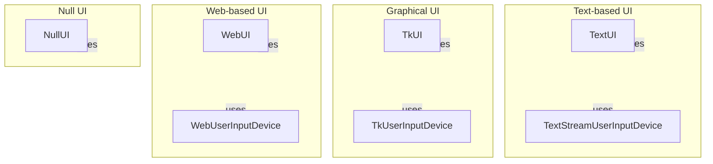

# User Interface Overview

## Introduction

This project is a game framework designed to provide various user interface options for both graphical and text-based interactions. It aims to facilitate the development of games by offering a structured way to manage user inputs and visual representations of game states. The framework is particularly useful for game developers looking to implement different types of user interfaces, whether they prefer a minimalistic approach or a more complex graphical environment.

The project addresses the challenges of managing user interactions and rendering game states across different platforms, including console applications and web-based interfaces. It is intended for developers who want to create engaging gaming experiences without needing to build UI components from scratch, allowing them to focus on game logic and design.

## Architecture Overview

The architecture of this project is organized into several key modules, each responsible for different aspects of the user interface. The main components include:

- **Text-based UI**: Managed by the `text.py` module, which includes classes like `TextUI` and `TextStreamUserInputDevice` for handling console interactions.
- **Graphical UI**: Handled by the `tk.py` module, utilizing the Tkinter library to create a GUI with classes like `TkUI` and `TkUserInputDevice`.
- **Web-based UI**: Implemented in the `web.py` module, which provides a web interface through classes such as `WebUI` and `WebUserInputDevice`.
- **Null UI**: A minimalist option provided by the `null.py` module through the `NullUI` class, which focuses on rendering without sprite resources.

These modules work together to provide a cohesive user experience, allowing developers to choose the most suitable interface for their game. The design leverages patterns such as producer-consumer for input handling and threading for web server operations, ensuring responsiveness and efficiency.

## Key Modules

### pacai/ui/text.py
This module provides a text-based user interface for console applications. It includes the `TextUI` class for rendering game states and managing user interactions, as well as the `TextStreamUserInputDevice` class for real-time input processing. These components work together to create an interactive experience in a text environment.

### pacai/ui/tk.py
The graphical user interface is managed in this module using the Tkinter library. The `TkUI` class handles the game window's lifecycle, while the `TkUserInputDevice` class manages keyboard events. Together, they facilitate a dynamic and responsive graphical experience for users.

### pacai/ui/web.py
This module is dedicated to web-based interactions, providing classes like `WebUI` for managing the web server and `WebUserInputDevice` for handling user inputs. It integrates HTTP request handling and server operations to create a seamless gaming experience through a web interface.

### pacai/ui/null.py
The `null.py` module offers a minimalist UI option through the `NullUI` class, which focuses on rendering the game state without requiring sprite resources. This lightweight approach is suitable for scenarios where a simple visual output is needed.

## Getting Started

New contributors should start by familiarizing themselves with the `pacai/ui/` package, as it contains the core components for user interface management. The most important files to understand first are:

- **text.py**: This file introduces the text-based interaction model and is essential for those looking to implement console-based games.
- **tk.py**: For developers interested in graphical interfaces, this module provides the necessary classes to create and manage a Tkinter-based UI.
- **web.py**: This file is crucial for those aiming to develop web-based games, as it covers HTTP handling and user input management.

By understanding these modules, contributors can effectively engage with the project and contribute to enhancing the user interface capabilities of the framework.