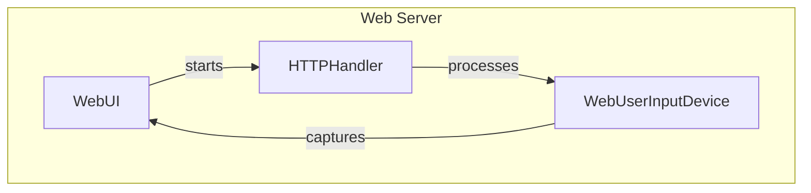

# Web-Based Interfaces

## Overview

The `WebUI` module is designed to facilitate web-based interactions in games, allowing developers to create engaging user interfaces that operate over a web server. By integrating with various components, such as HTTP handlers and user input devices, this module enables real-time updates and interactions, making it suitable for games that require a web-based front end. Developers would use this module when they want to provide users with a seamless gaming experience through a browser, leveraging the capabilities of web technologies to enhance gameplay.

## Architecture & Design

The `WebUI` module employs a multi-threaded architecture to manage web server operations concurrently. It utilizes design patterns such as the producer-consumer model for handling user inputs and the request-response pattern for processing HTTP requests. Key abstractions include the `WebUI`, `HTTPHandler`, and `WebUserInputDevice`, which work together to manage the flow of data and user interactions.

### Data Flow

1. User inputs are captured via the `WebUserInputDevice`.
2. Inputs are processed and sent to the `HTTPHandler`, which manages the state of the game and responds to requests.
3. The `WebUI` class orchestrates the overall interaction, starting the server and rendering the game state.



## Key Components

### Main Classes

- **WebUI**
  - **Responsibilities**: Manages the web server, initializes the game interface, and handles game state rendering.
  - **Key Methods**:
    - `__init__`: Initializes the web server instance.
    - `game_start`: Starts the server and initializes the game.
    - `draw`: Updates the visual representation of the game state.

- **HTTPHandler**
  - **Responsibilities**: Manages HTTP requests and responses, ensuring thread-safe access to game state data.
  - **Key Methods**:
    - `do_GET`: Handles incoming GET requests.
    - `do_POST`: Processes POST requests with game data.
    - `get_data`: Retrieves current game state and image URL.

- **WebUserInputDevice**
  - **Responsibilities**: Captures and processes user actions through keyboard inputs.
  - **Key Methods**:
    - `__init__`: Initializes the input device with optional character mapping.
    - `add_keys`: Updates the action list based on user inputs.
    - `get_inputs`: Retrieves and clears the action list.

### Important Functions

- **_run_server**: Starts the HTTP server on the current thread, ensuring it accepts requests only when ready.
- **_handler_update**: Processes requests for additional data, updating the game state and image URL.
- **_handler_not_found**: Generates a response for 404 errors when a route is not found.

### Component Interactions

The `WebUI` class interacts with the `HTTPHandler` to manage incoming requests and responses, while the `WebUserInputDevice` captures user inputs that are processed and sent to the `HTTPHandler`. This interaction ensures a smooth flow of data between the user and the game state, allowing for real-time updates and interactions.

## Usage Examples

### Common Use Cases

1. **Starting a Web Game**: Developers can initialize a game using the `WebUI` class, which sets up the server and displays the game interface in a web browser.
2. **Handling User Inputs**: By utilizing the `WebUserInputDevice`, developers can capture keyboard inputs and map them to game actions, enhancing interactivity.

### How to Use the Main Classes

To start a web-based game, a developer would typically create an instance of the `WebUI` class, call the `game_start` method with the initial game state, and then use the `draw` method to update the game visuals as needed.

```python
from pacai.ui.web import WebUI

# Initialize the web user interface
web_ui = WebUI()
web_ui.game_start(initial_game_state)
```

## Important Details

### Configuration or Setup Requirements

- Ensure that the necessary web server dependencies are installed and configured.
- The game must be designed to handle real-time updates and interactions through the web interface.

### Caveats and Important Notes

- The `WebUI` class operates in a multi-threaded environment, so developers should be cautious about thread safety when accessing shared resources.
- Proper error handling should be implemented in the `HTTPHandler` to manage unexpected requests and maintain a robust user experience.

By leveraging the `WebUI` module, developers can create dynamic and interactive web-based games that enhance user engagement and provide a seamless gaming experience.